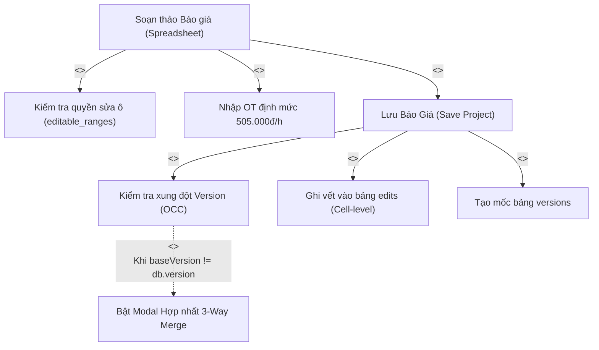
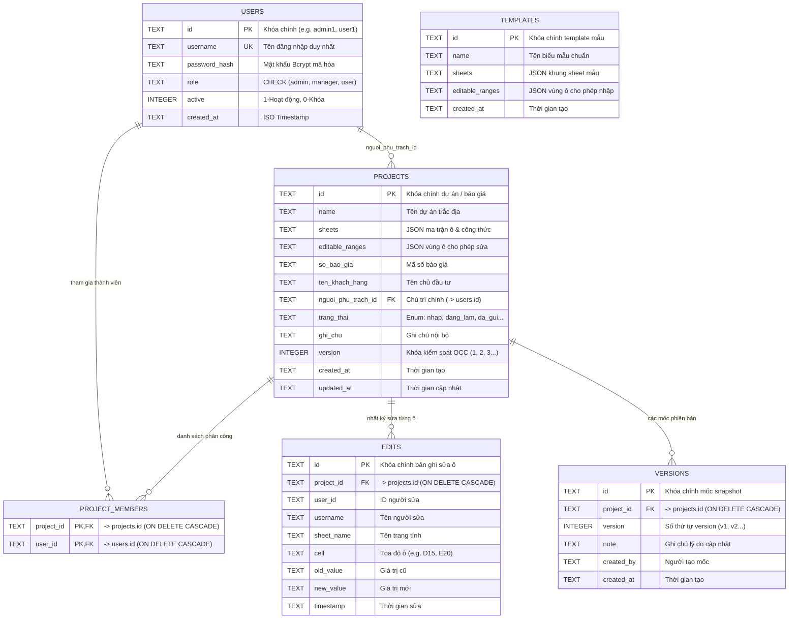

# ĐẶC TẢ USE CASE & CƠ SỞ DỮ LIỆU TOÀN DIỆN
## HỆ THỐNG BÁO GIÁ & QUẢN LÝ DỰ TOÁN TRẮC ĐỊA PHÚC GIA

> **Tài liệu kỹ thuật**: Chuẩn hóa Use Case 3 Actors (Admin – Kế toán/Manager – Nhân viên/User) & Mô hình Thực thể Cơ sở dữ liệu SQLite (`baogia.db`).

---

## MỤC LỤC
1. [Sơ Đồ Use Case Tổng Thể (System Use Case Diagram)](#1-sơ-đồ-use-case-tổng-thể-system-use-case-diagram)
2. [Sơ Đồ Phân Rã Quan Hệ Use Case (`<<include>>` / `<<extend>>`)](#2-sơ-đồ-phân-rã-quan-hệ-use-case-include--extend)
3. [Bảng Đặc Tả Chi Tiết 21 Use Cases Theo Ma Trận CRUD](#3-bảng-đặc-tả-chi-tiết-21-use-cases-theo-ma-trận-crud)
4. [Đặc Tả Luồng Sự Kiện Use Case Trọng Tâm: Xử Lý Xung Đột Đồng Thời (OCC 3-Way Merge)](#4-đặc-tả-luồng-sự-kiện-use-case-trọng-tâm-xử-lý-xung-đột-đồng-thời-occ-3-way-merge)
5. [Sơ Đồ Thực Thể Quan Hệ Cơ Sở Dữ Liệu (Database ERD)](#5-sơ-đồ-thực-thể-quan-hệ-cơ-sở-dữ-liệu-database-erd)
6. [Từ Điển Dữ Liệu Chi Tiết 6 Bảng Chuẩn Hóa (`baogia.db`)](#6-từ-điển-dữ-liệu-chi-tiết-6-bảng-chuẩn-hóa-baogiadb)
7. [Bảng Đối Chiếu & Xác Nhận Tính Đầy Đủ Của Database](#7-bảng-đối-chiếu--xác-nhận-tính-đầy-đủ-của-database)

---

## 1. SƠ ĐỒ USE CASE TỔNG THỂ (SYSTEM USE CASE DIAGRAM)

```mermaid
flowchart LR
    %% ACTORS
    subgraph ACTORS["TÁC NHÂN HỆ THỐNG (ACTORS)"]
        direction TB
        Admin["👑 ADMIN<br/>(Ban Giám Đốc / Quản trị tối cao)"]
        KeToan["💼 KẾ TOÁN / MANAGER<br/>(Quản lý Tài chính & Thuế)"]
        NhanVien["👷 NHÂN VIÊN / USER<br/>(Kỹ sư Trắc địa / Sale)"]
    end

    %% SYSTEM BOUNDARY
    subgraph SYSTEM["HỆ THỐNG BÁO GIÁ PHÚC GIA (baogia.db)"]
        direction TB
        
        %% PHÂN HỆ 1: QUẢN LÝ BÁO GIÁ (CRUD CORE)
        subgraph MOD1["1. QUẢN LÝ BÁO GIÁ (CRUD PROJECTS)"]
            UC_Create["UC01: Tạo mới báo giá<br/>(Create Project/Quote)"]
            UC_ReadOwn["UC02: Xem báo giá được phân công<br/>(Read Assigned/Owner)"]
            UC_ReadAll["UC03: Xem toàn bộ báo giá<br/>(Read All Projects)"]
            UC_EditTech["UC04: Sửa khối lượng & kỹ thuật<br/>(Edit Tech in editable_ranges)"]
            UC_EditFin["UC05: Sửa đơn giá, VAT, chiết khấu<br/>(Edit Price & Tax)"]
            UC_InputOT["UC06: Nhập giờ làm thêm OT<br/>(Input Overtime Hours)"]
            UC_Assign["UC07: Phân công nhiều người làm<br/>(Assign project_members)"]
            UC_ApproveFin["UC08: Thẩm định tài chính<br/>(Financial Approval)"]
            UC_ApproveFinal["UC09: Phê duyệt phát hành<br/>(Final Director Approval)"]
            UC_Lock["UC10: Khóa / Mở khóa báo giá<br/>(Lock / Unlock Project)"]
            UC_Delete["UC11: Xóa / Lưu trữ báo giá<br/>(Delete / Archive Project)"]
        end

        %% PHÂN HỆ 2: ĐỒNG THỜI & PHIÊN BẢN (OCC & TIME MACHINE)
        subgraph MOD2["2. ĐỒNG THỜI & PHIÊN BẢN (OCC & EDITS)"]
            UC_Merge["UC12: Giải quyết xung đột 3-Way Merge<br/>(Resolve OCC Conflict)"]
            UC_CellLog["UC13: Ghi vết sửa từng ô<br/>(Cell-level edits Log)"]
            UC_History["UC14: Xem lịch sử các phiên bản<br/>(View versions History)"]
            UC_Restore["UC15: Khôi phục phiên bản cũ<br/>(Restore Snapshot Version)"]
        end

        %% PHÂN HỆ 3: MẪU BIỂU & XUẤT BẢN
        subgraph MOD3["3. MẪU BIỂU & XUẤT BẢN (TEMPLATES & EXPORT)"]
            UC_Template["UC16: Quản lý thư viện mẫu<br/>(Manage templates Library)"]
            UC_ExportDraft["UC17: Xuất Excel nháp có Watermark<br/>(Export Draft Excel)"]
            UC_ExportOfficial["UC18: Xuất Excel A4 chính thức<br/>(Export Official Excel)"]
        end

        %% PHÂN HỆ 4: QUẢN TRỊ HỆ THỐNG
        subgraph MOD4["4. QUẢN TRỊ NGƯỜI DÙNG & BẢO MẬT"]
            UC_UserMgmt["UC19: Quản lý người dùng (users)<br/>(User CRUD & Reset Password)"]
            UC_RoleMgmt["UC20: Phân quyền vai trò (Role)<br/>(Role Assignment)"]
            UC_AuditLog["UC21: Xem toàn bộ vết sửa đổi<br/>(Audit Trail from edits)"]
        end
    end

    %% LIÊN KẾT NHÂN VIÊN
    NhanVien --> UC_Create
    NhanVien --> UC_ReadOwn
    NhanVien --> UC_EditTech
    NhanVien --> UC_InputOT
    NhanVien --> UC_Merge
    NhanVien --> UC_CellLog
    NhanVien --> UC_ExportDraft

    %% LIÊN KẾT KẾ TOÁN / MANAGER
    KeToan --> UC_Create
    KeToan --> UC_ReadAll
    KeToan --> UC_EditFin
    KeToan --> UC_ApproveFin
    KeToan --> UC_Merge
    KeToan --> UC_CellLog
    KeToan --> UC_History
    KeToan --> UC_Template
    KeToan --> UC_ExportOfficial

    %% LIÊN KẾT ADMIN (TOÀN QUYỀN)
    Admin --> UC_Create
    Admin --> UC_ReadAll
    Admin --> UC_EditTech
    Admin --> UC_EditFin
    Admin --> UC_Assign
    Admin --> UC_ApproveFinal
    Admin --> UC_Lock
    Admin --> UC_Delete
    Admin --> UC_Merge
    Admin --> UC_History
    Admin --> UC_Restore
    Admin --> UC_Template
    Admin --> UC_ExportOfficial
    Admin --> UC_UserMgmt
    Admin --> UC_RoleMgmt
    Admin --> UC_AuditLog
```



---

## 2. SƠ ĐỒ PHÂN RÃ QUAN HỆ USE CASE (`<<include>>` / `<<extend>>`)



---

## 3. BẢNG ĐẶC TẢ CHI TIẾT 21 USE CASES THEO MA TRẬN CRUD

| Mã UC | Tên Use Case | Actor chính | Cấp độ CRUD | Ý nghĩa nghiệp vụ & Ràng buộc an toàn |
| :--- | :--- | :--- | :---: | :--- |
| **UC01** | Tạo mới báo giá | `Admin`, `Kế toán`, `Nhân viên` | **Create** | Khởi tạo dự án trong bảng `projects` từ mẫu hoặc tạo trắng, mặc định `version = 1`, `trang_thai = 'nhap'`. |
| **UC02** | Xem báo giá được giao | `Nhân viên` | **Read** | **Chống IDOR**: Nhân viên chỉ xem được khi `nguoi_phu_trach_id == user.id` HOẶC có trong bảng `project_members`. |
| **UC03** | Xem toàn bộ báo giá | `Admin`, `Kế toán` | **Read** | Xem danh sách tất cả các báo giá của toàn bộ công ty. |
| **UC04** | Sửa khối lượng & kỹ thuật | `Nhân viên`, `Admin` | **Update** | Chỉ được sửa trong các ô thuộc `editable_ranges`. *Kế toán không sửa khối lượng hiện trường*. |
| **UC05** | Sửa đơn giá, VAT, chiết khấu | `Kế toán`, `Admin` | **Update** | Kế toán áp thuế VAT 8%, chiết khấu, đơn giá. *Nhân viên bị khóa không can thiệp*. |
| **UC06** | Nhập giờ làm thêm OT | `Nhân viên`, `Admin` | **Update** | Nhập số giờ làm thêm thực tế ngoài hiện trường, tự nhân `505.000 VNĐ/giờ`. |
| **UC07** | Phân công nhiều người làm | `Admin` | **Update** | Thêm nhiều User vào bảng `project_members` để 2 hoặc nhiều người cùng phối hợp. |
| **UC08** | Thẩm định tài chính | `Kế toán` | **Update** | Chuyển trạng thái từ `dang_lam` $\rightarrow$ `cho_duyet` sau khi kiểm tra biên lợi nhuận. |
| **UC09** | Phê duyệt phát hành | `Admin` | **Update** | Chuyển trạng thái sang `da_duyet` (Khóa chỉnh sửa nội dung). |
| **UC10** | Khóa / Mở khóa báo giá | `Admin` | **Update** | Đặt trạng thái `da_gui` / `da_duyet` để khóa quyền sửa của nhân viên. |
| **UC11** | Xóa / Lưu trữ báo giá | `Admin`, `Kế toán`, `Nhân viên` | **Delete** | Nhân viên xóa nháp; Kế toán lưu trữ; Admin xóa vĩnh viễn (Cascade). |
| **UC12** | Giải quyết xung đột 3-Way Merge | `Nhân viên`, `Kế toán`, `Admin` | **Update** | Tự kích hoạt khi gặp lỗi `409 Conflict`, cho phép hợp nhất dữ liệu an toàn. |
| **UC13** | Ghi vết sửa từng ô | `Hệ thống (Auto)` | **Create** | Tự động ghi vào bảng `edits` mỗi khi người dùng thay đổi giá trị ô (Cell-level). |
| **UC14** | Xem lịch sử các phiên bản | `Admin`, `Kế toán` | **Read** | Đọc dữ liệu từ bảng `versions` để xem dòng thời gian thay đổi. |
| **UC15** | Khôi phục phiên bản cũ | `Admin` | **Update** | Lấy dữ liệu mốc snapshot cũ ghi đè lại vào `projects.sheets`. |
| **UC16** | Quản lý thư viện mẫu | `Admin`, `Kế toán` | **CRUD** | Quản lý bảng `templates` (thêm mẫu đo vẽ địa hình, quan trắc lún...). |
| **UC17** | Xuất Excel nháp có Watermark | `Nhân viên` | **Read** | Tải file Excel có chữ chìm "BẢN DỰ THẢO - CHƯA DUYỆT". |
| **UC18** | Xuất Excel A4 chính thức | `Kế toán`, `Admin` | **Read** | Tải file Excel A4 chuẩn thể thức Phúc Gia khi đã duyệt. |
| **UC19** | Quản lý người dùng | `Admin` | **CRUD** | Thêm, sửa, khóa tài khoản (`users.active`), đặt lại mật khẩu Bcrypt. |
| **UC20** | Phân quyền vai trò | `Admin` | **Update** | Thiết lập role (`admin`, `manager`, `user`) cho từng tài khoản. |
| **UC21** | Xem toàn bộ vết sửa đổi | `Admin` | **Read** | Truy vấn bảng `edits` để kiểm toán toàn bộ lịch sử chỉnh sửa ô. |

---

## 4. ĐẶC TẢ LUỒNG SỰ KIỆN USE CASE TRỌNG TÂM: XỬ LÝ XUNG ĐỘT ĐỒNG THỜI (OCC 3-WAY MERGE)

### Luồng sự kiện tuần tự (Sequence Flow):
1. **Tiền điều kiện**: Cả 2 người dùng (User A và User B) cùng mở báo giá có `version = 1`.
2. **Hành động 1**: User A sửa khối lượng ô `D10` và bấm **Lưu**.
   - Server kiểm tra `baseVersion (1) == db.version (1)` $\rightarrow$ Hợp lệ!
   - Server cập nhật `projects.sheets`, tăng `projects.version = 2`, ghi vào `edits` và `versions`.
3. **Hành động 2**: User B sửa thuế VAT ô `E30` và bấm **Lưu** (gửi kèm `baseVersion = 1`).
   - Server kiểm tra: `baseVersion (1) != db.version (2)` $\rightarrow$ **Phát hiện xung đột!**
   - Server trả về mã HTTP `409 CONFLICT` kèm dữ liệu mới nhất trên Database.
4. **Hợp nhất (3-Way Merge)**:
   - Frontend hiển thị giao diện đối chiếu 3 cột (*Dữ liệu mới Server* vs *Dữ liệu User B vừa sửa* vs *Bản hợp nhất*).
   - User B chọn giữ cả 2 thay đổi (Khối lượng của A + Thuế của B) và nhấn **Xác nhận Lưu**.
5. **Hậu điều kiện**: Dữ liệu được lưu thành `version = 3` thành công 100%, không bị mất bất kỳ số liệu nào của cả 2 người.

---

## 5. SƠ ĐỒ THỰC THỂ QUAN HỆ CƠ SỞ DỮ LIỆU (DATABASE ERD)



---

## 6. TỪ ĐIỂN DỮ LIỆU CHI TIẾT 6 BẢNG CHUẨN HÓA (`baogia.db`)

### 6.1. Bảng `users` (Quản Lý Tài Khoản & Vai Trò)
```sql
CREATE TABLE IF NOT EXISTS users (
  id TEXT PRIMARY KEY,
  username TEXT NOT NULL UNIQUE,
  password_hash TEXT NOT NULL,
  role TEXT NOT NULL CHECK(role IN ('admin','manager','user')),
  active INTEGER NOT NULL DEFAULT 1,
  created_at TEXT NOT NULL
);
```

### 6.2. Bảng `projects` (Quản Lý Báo Giá & Ma Trận Bảng Tính)
```sql
CREATE TABLE IF NOT EXISTS projects (
  id TEXT PRIMARY KEY,
  name TEXT NOT NULL,
  sheets TEXT NOT NULL DEFAULT '[]',
  editable_ranges TEXT NOT NULL DEFAULT '{}',
  so_bao_gia TEXT NOT NULL DEFAULT '',
  ten_khach_hang TEXT NOT NULL DEFAULT '',
  nguoi_phu_trach_id TEXT,
  trang_thai TEXT NOT NULL DEFAULT 'nhap',
  ghi_chu TEXT NOT NULL DEFAULT '',
  version INTEGER NOT NULL DEFAULT 1,
  created_at TEXT NOT NULL,
  updated_at TEXT NOT NULL,
  FOREIGN KEY (nguoi_phu_trach_id) REFERENCES users(id)
);
```

### 6.3. Bảng `project_members` (Phân Công Nhiều Người Cùng Làm)
```sql
CREATE TABLE IF NOT EXISTS project_members (
  project_id TEXT NOT NULL,
  user_id TEXT NOT NULL,
  PRIMARY KEY (project_id, user_id),
  FOREIGN KEY (project_id) REFERENCES projects(id) ON DELETE CASCADE,
  FOREIGN KEY (user_id) REFERENCES users(id) ON DELETE CASCADE
);
```

### 6.4. Bảng `edits` (Nhật Ký Sửa Đổi Từng Tọa Độ Ô - Cell Level)
```sql
CREATE TABLE IF NOT EXISTS edits (
  id TEXT PRIMARY KEY,
  project_id TEXT NOT NULL,
  user_id TEXT NOT NULL,
  username TEXT NOT NULL,
  sheet_name TEXT NOT NULL,
  cell TEXT NOT NULL,
  old_value TEXT,
  new_value TEXT,
  timestamp TEXT NOT NULL,
  FOREIGN KEY (project_id) REFERENCES projects(id) ON DELETE CASCADE
);
```

### 6.5. Bảng `versions` (Lịch Sử Mốc Phiên Bản Snapshot - Time Machine)
```sql
CREATE TABLE IF NOT EXISTS versions (
  id TEXT PRIMARY KEY,
  project_id TEXT NOT NULL,
  version INTEGER NOT NULL,
  note TEXT NOT NULL DEFAULT '',
  created_by TEXT NOT NULL,
  created_at TEXT NOT NULL,
  FOREIGN KEY (project_id) REFERENCES projects(id) ON DELETE CASCADE
);
```

### 6.6. Bảng `templates` (Thư Viện Biểu Mẫu Trắc Địa Chuẩn)
```sql
CREATE TABLE IF NOT EXISTS templates (
  id TEXT PRIMARY KEY,
  name TEXT NOT NULL,
  sheets TEXT NOT NULL DEFAULT '[]',
  editable_ranges TEXT NOT NULL DEFAULT '{}',
  created_at TEXT NOT NULL
);
```

---

## 7. BẢNG ĐỐI CHIẾU & XÁC NHẬN TÍNH ĐẦY ĐỦ CỦA DATABASE

| Nghiệp Vụ Yêu Cầu | Thành Phần Trong `baogia.db` Hiện Tại Đáp Ứng | Kết Luận |
| :--- | :--- | :--- |
| **Phân quyền 3 Roles** | `users.role` + `projects.editable_ranges` (Khóa ô công thức, chỉ mở ô khối lượng cho nhân viên). | ✅ **Đầy đủ 100%** |
| **Chống rò rỉ IDOR** | `projects.nguoi_phu_trach_id` + `project_members` + hàm `userCanAccessProject()`. | ✅ **Đầy đủ 100%** |
| **Admin giao 1 file cho 2 người** | Bảng trung gian `project_members(project_id, user_id)`. | ✅ **Đầy đủ 100%** |
| **2 người cùng sửa 1 lúc không đè nhau** | `projects.version` (Kiểm soát OCC) + Kích hoạt 3-Way Merge khi có mã lỗi `409`. | ✅ **Đầy đủ 100%** |
| **Kiểm toán vết sửa từng ô** | Bảng `edits` lưu chi tiết: Tọa độ ô (`cell`), giá trị cũ/mới, ai sửa, lúc nào. | ✅ **Đầy đủ 100%** |
| **Lịch sử phiên bản (Time Machine)** | Bảng `versions` lưu lại từng mốc v1, v2, v3... | ✅ **Đầy đủ 100%** |
| **Thư viện mẫu báo giá trắc địa** | Bảng `templates` phục vụ nhân bản bảng tính nhanh. | ✅ **Đầy đủ 100%** |

👉 **KẾT LUẬN CHÍNH THỨC**: Cơ sở dữ liệu hiện tại của dự án (`baogia.db` gồm 6 bảng: `users`, `projects`, `project_members`, `edits`, `versions`, `templates`) **đã hoàn chỉnh 100%**, đáp ứng toàn diện mọi yêu cầu nghiệp vụ, bảo mật và kiểm soát đồng thời mà không cần thêm bất kỳ bảng nào khác.
