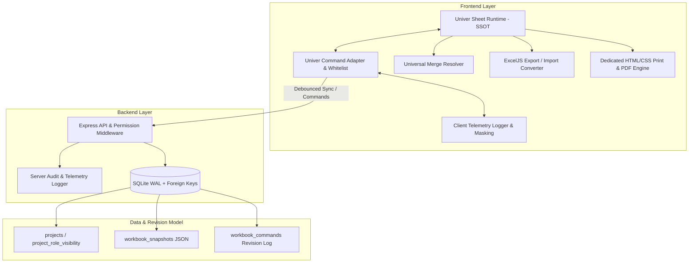

# BẢN THIẾT KẾ KIẾN TRÚC & KẾ HOẠCH TRIỂN KHAI CHUẨN HÓA
## DỰ ÁN BÁO GIÁ PHÚC GIA (ENTERPRISE SPREADSHEET & QUOTATION SYSTEM)

---

## I. CÁC QUYẾT ĐỊNH KIẾN TRÚC NỀN TẢNG (ARCHITECTURAL DECISIONS)

Dựa trên phản biện kỹ thuật và phản hồi thống nhất, hệ thống được chuẩn hóa với các nguyên tắc cốt lõi:



### 1. Nguồn Dữ Liệu Chuẩn (Single Source of Truth - SSOT)
* **Runtime SSOT**: `Univer Instance Document Model`. Mọi thao tác chỉnh sửa giá trị, công thức, định dạng, merge cell đều được quản lý tập trung trên Univer.
* **Storage Model**: Backend lưu trữ snapshot JSON định kỳ (`workbook_snapshots`) kết hợp Command Log (`workbook_commands`) để quản lý lịch sử revision, conflict resolution và undo/redo theo phiên bản.
* **Converter Adapter (ExcelJS)**: Chỉ đóng vai trò import file `.xlsx` gốc vào Univer snapshot và export snapshot thành file binary `.xlsx` khi người dùng tải xuống.
* **React State**: Đóng vai trò View/Presentation Cache mỏng, không tham gia vào vòng lặp đồng bộ trực tiếp để loại bỏ rủi ro infinite loop và lệch trạng thái.

### 2. Bộ Chuyển Đổi Lệnh & Whitelist (Univer Command Adapter)
* Xây dựng `univerCommandAdapter` đóng gói các command nội bộ của Univer.
* Thiết lập whitelist command cần theo dõi:
  - Giá trị & Công thức: `SetRangeValuesCommand`
  - Định dạng ô (Font, Color, BG, Border, Align): `SetRangeStyleCommand`, `SetRangeBackgroundCommand`
  - Định dạng số (Currency, Percent, Number): `SetRangeNumberFormatCommand`
  - Gộp ô: `AddWorksheetMergeMutation`, `RemoveWorksheetMergeMutation`
  - Sort & Filter: `SetFilterRangeCommand`, `SortRangeCommand`
* Cơ chế **Debounce / Batching (300ms)** khi gửi về server để tối ưu hiệu năng mạng và tránh lag UI.

### 3. Utility Trung Tâm Xử Lý Merge & Center (Universal Merge Resolver)
Xây dựng module dùng chung `src/lib/mergeResolver.ts`:
```typescript
export interface MergeInfo {
  isMaster: boolean;
  masterCell: { row: number; column: number; address: string };
  range: { startRow: number; endRow: number; startColumn: number; endColumn: number; rangeRef: string };
}

// Dùng thống nhất cho: Formula Picker, Format Painter, Sort/Filter, Find/Replace, Copy/Paste, Export
export function resolveMergeInfo(row: number, column: number, merges: IRange[]): MergeInfo;
export function resolveMasterCellAddress(address: string, merges: IRange[]): string;
```

### 4. Động Cơ Xuất File & In Ấn Chuyên Dụng (Export & Print Engine)
* **Export Excel**: Trích xuất snapshot từ Univer -> Mapping sang ExcelJS Workbook giữ nguyên đầy đủ: values, formulas, cell styles (font, fill, border, alignment), number formats, merges, row heights, column widths -> Xuất Blob `.xlsx`.
* **Print Engine**: Xây dựng Print View chuyên dụng render HTML Table chuẩn khổ A4 (Portrait/Landscape) với:
  - Header bảng lặp lại khi sang trang mới (`thead { display: table-header-group }`).
  - Phân trang chuẩn xác (`page-break-inside: avoid`), không bị cắt ngang dòng chữ.
  - Tỷ lệ 100% chuẩn khung Báo Giá Phúc Gia, ẩn hoàn toàn Ribbon/Toolbar/Sidebars khi gọi lệnh in.

### 5. Chuẩn Hóa Cơ Sở Dữ Liệu Phân Quyền & Ẩn File (Permission & Visibility Schema)
Tách bảng quan hệ chuẩn hóa trong SQLite:
```sql
CREATE TABLE IF NOT EXISTS project_role_visibility (
  id TEXT PRIMARY KEY,
  project_id TEXT NOT NULL,
  role TEXT NOT NULL CHECK(role IN ('admin', 'manager', 'user')),
  user_id TEXT, -- NULL áp dụng cho toàn bộ role, hoặc chỉ định user cụ thể
  is_hidden INTEGER NOT NULL DEFAULT 0 CHECK(is_hidden IN (0, 1)),
  can_view INTEGER NOT NULL DEFAULT 1 CHECK(can_view IN (0, 1)),
  can_edit INTEGER NOT NULL DEFAULT 0 CHECK(can_edit IN (0, 1)),
  hidden_by TEXT NOT NULL,
  hidden_at TEXT NOT NULL,
  UNIQUE(project_id, role, user_id),
  FOREIGN KEY (project_id) REFERENCES projects(id) ON DELETE CASCADE
);
```
Enforce 100% tại `server/middlewares/auth` và SQL Query lọc dữ liệu từ server, không chỉ ẩn trên giao diện frontend.

### 6. Danh Mục Công Thức Bắt Buộc Tương Thích 100%
1. **Số học & Thống kê**: `SUM`, `AVERAGE`, `MIN`, `MAX`, `COUNT`, `COUNTA`, `ROUND`, `ROUNDUP`, `ROUNDDOWN`, `INT`, `PRODUCT`.
2. **Logic & Tra cứu**: `IF`, `IFS`, `AND`, `OR`, `SUMIF`, `SUMIFS`, `COUNTIF`, `COUNTIFS`, `VLOOKUP`, `INDEX`, `MATCH`, `XLOOKUP`.
3. **Chuỗi & Thời gian**: `CONCATENATE` / `&`, `TEXT`, `LEFT`, `RIGHT`, `MID`, `DATE`, `YEAR`, `MONTH`, `DAY`, `TODAY`, `NOW`.
4. **Tham chiếu**: Tham chiếu liên sheet (`'Sheet Báo Giá'!A1`), tham chiếu ô gộp Merge & Center.

---

## II. THIẾT KẾ TELEMETRY LOGGER & CHIẾN LƯỢC TEST THEO TỪNG GIAI ĐOẠN

```
                                 TEST PYRAMID & VERIFICATION LOGS
                                 
                                        ▲
                                       / \
                                      /E2E\     Playwright / Full Flow Test
                                     / UI  \    (Export, Print, Admin/User workflow)
                                    /-------\
                                   / Integr- \  API & Database Integration Tests
                                  /  ation    \ (Visibility, Permissions, Compaction)
                                 /-------------\
                                /   Unit Tests  \ Formula, Merge Resolver, Style Adapter,
                               /_________________\ Command Whitelist, Number Formatting
```

### Cấu trúc Log có Masking bảo mật (PII & Business Data Safe):
```json
{
  "timestamp": "2026-10-09T09:15:00.123Z",
  "correlationId": "req-984f-123",
  "level": "INFO",
  "phase": "PHASE_2_FORMAT",
  "module": "COMMAND_ADAPTER",
  "action": "APPLY_CELL_FORMAT",
  "target": { "sheet": "BaoGia", "range": "B5:D5", "isMerged": true, "masterCell": "B5" },
  "appliedStyle": { "bold": true, "bg": "#fff2cc", "numberFormat": "#,##0 ₫" },
  "status": "SUCCESS",
  "durationMs": 4.2
}
```

---

## III. LỘ TRÌNH TRIỂN KHAI THEO THỨ TỰ ƯU TIÊN (REVISED ACTION PLAN)

| Thứ tự | Module / Giai đoạn | Chi tiết công việc thực hiện | Tiêu chí nghiệm thu & Log kiểm thử |
| :---: | :--- | :--- | :--- |
| **P0** | **Kiến trúc Dữ liệu, Migration & Logger Tối Giản** | 1. Viết script migration DB: tạo bảng `project_role_visibility`, `workbook_snapshots`, `workbook_commands`.<br>2. Xây dựng Logger có Masking & Correlation ID.<br>3. Thiết lập test harness chạy từng giai đoạn. | Migration chạy thành công, rollback an toàn, logger ghi log có cấu trúc. |
| **P1** | **Universal Merge Resolver Dùng Chung** | 1. Xây dựng `src/lib/mergeResolver.ts`.<br>2. Áp dụng cho Formula Cell Picker: click ô bất kỳ trong Merge Range tự động quy về Master Cell.<br>3. Kiểm thử 4 nhóm hàm Excel bắt buộc với ô gộp. | Unit test 100% Passed cho các trường hợp gộp ô phức tạp, công thức tính đúng kết quả. |
| **P2** | **Định Dạng Cell & Univer Command Adapter & Format Painter** | 1. Xây dựng `univerCommandAdapter` bắt whitelist format/style.<br>2. Đồng bộ style 2 chiều vào Univer Runtime SSOT & debounced snapshot.<br>3. Kích hoạt Format Painter (single/persistent click, đổi con trỏ, Esc hủy, undo/redo). | Định dạng lưu vĩnh viễn, Format Painter sao chép chuẩn qua cả ô đơn lẫn ô merge. |
| **P3** | **Sort & Filter và Find & Replace** | 1. Đăng ký và gắn kết Univer Sort/Filter commands.<br>2. Tích hợp thanh công cụ/Modal Find & Replace hỗ trợ: Match case, toàn ô, tìm trên sheet/workbook, nhảy tiêu điểm trực tiếp đến ô tìm thấy. | Lọc dữ liệu, sắp xếp A-Z/Z-A, tìm và thay thế hoạt động mượt mà không block UI. |
| **P4** | **Cơ chế Phân Quyền & Ẩn File Cấp Server & UI** | 1. Enforce quyền ẩn/hiện file qua `project_role_visibility` tại Server Middleware & SQLite Query.<br>2. Thêm UI trên Admin/Executive Dashboard cho phép Admin ẩn file nháp với Manager, và Manager ẩn file với User.<br>3. Kiểm thử bảo mật chặn truy cập trực tiếp qua API. | User/Manager bị chặn không thấy và không tải được file bị ẩn; Admin quản lý linh hoạt. |
| **P5** | **Động Cơ Xuất File Mẫu Tạm & In Ấn Khổ A4 Chuyên Dụng** | 1. Xây dựng bộ trích xuất snapshot Univer -> ExcelJS binary `.xlsx` đầy đủ style, format, merge, công thức.<br>2. Xây dựng trang Print View chuẩn khổ A4 Dọc/Ngang với CSS in ấn chuyên nghiệp (lặp header, phân trang mượt). | Tải file Excel tức thì chuẩn 100% dữ liệu đã sửa; In trực tiếp ra bản PDF/giấy sắc nét. |
| **P6** | **Chạy Test Suite Toàn Diện & Xuất Log Minh Chứng Nghiệm Thu** | 1. Chạy trọn bộ Unit, Integration và E2E scenarios.<br>2. Thu thập và xuất file `test-run-verification.log` chi tiết làm bằng chứng nghiệm thu kỹ thuật. | File log minh chứng đạt 100% Passed cho tất cả các ca kiểm thử. |

---

## IV. BƯỚC TIẾP THEO

Toàn bộ các quyết định kiến trúc và thứ tự ưu tiên đã được chuẩn hóa. Tôi sẵn sàng tiến hành triển khai ngay từ **Giai đoạn P0 (Migration DB & Logger)** và tuần tự chuyển sang các giai đoạn tiếp theo.
