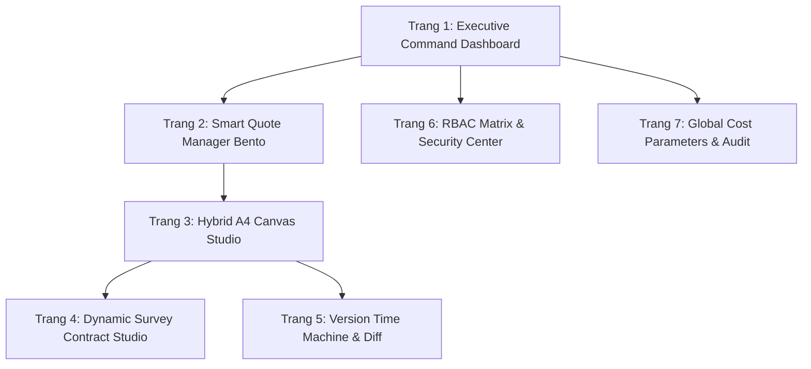
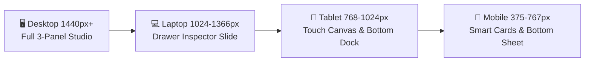

# BẢN KẾ HOẠCH THIẾT KẾ CHI TIẾT TỪNG TRANG GIAO DIỆN HỆ THỐNG BÁO GIÁ PHÚC GIA

> **Dự án**: Tái thiết kế toàn diện giao diện & Hệ thống Báo giá - Hợp đồng Trắc địa Phúc Gia  
> **Nguyên tắc cốt lõi**: Bố cục Phi tiêu chuẩn (Non-standard Modern Workspace) • Chuẩn màu nhận diện thương hiệu Phúc Gia • Đáp ứng Responsive đa nền tảng • Zero Technical Debt (Không nợ & Không lỗi kỹ thuật).

---

## MỤC LỤC
1. [Hệ Thống Design Tokens & Màu Sắc Thương Hiệu](#1-hệ-thống-design-tokens--màu-sắc-thương-hiệu)
2. [Triết Lý Bố Cục Phi Tiêu Chuẩn (Modern Spatial Layout)](#2-triết-lý-bố-cục-phi-tiêu-chuẩn-modern-spatial-layout)
3. [Thiết Kế Chi Tiết Từng Trang Giao Diện (7 Màn Hình)](#3-thiết-kế-chi-tiết-từng-trang-giao-diện-7-màn-hình)
   - [Trang 1: Executive Command Center (Dashboard Điều Hành)](#trang-1-executive-command-center-dashboard-điều-hành)
   - [Trang 2: Smart Quote Manager (Quản Lý Báo Giá Thông Minh)](#trang-2-smart-quote-manager-quản-lý-báo-giá-thông-minh)
   - [Trang 3: Unified Smart Workspace (Studio Soạn Thảo Báo Giá A4)](#trang-3-unified-smart-workspace-studio-soạn-thảo-báo-giá-a4)
   - [Trang 4: Dynamic Survey Contract Studio (Xuất Bản Hợp Đồng Trắc Địa)](#trang-4-dynamic-survey-contract-studio-xuất-bản-hợp-đồng-trắc-địa)
   - [Trang 5: Version Time Machine (Lịch Sử Phiên Bản & Visual Diff)](#trang-5-version-time-machine-lịch-sử-phiên-bản--visual-diff)
   - [Trang 6: Trung Tâm Phân Quyền & Bảo Mật RBAC Matrix](#trang-6-trung-tâm-phân-quyền--bảo-mật-rbac-matrix)
   - [Trang 7: Global Cost Parameters & Audit Log](#trang-7-global-cost-parameters--audit-log)
4. [Chiến Lược Responsive Đa Thiết Bị](#4-chiến-lược-responsive-đa-thiết-bị)
5. [Kiến Trúc Kỹ Thuật Sạch & Tiêu Chuẩn Zero Technical Debt](#5-kiến-trúc-kỹ-thuật-sạch--tiêu-chuẩn-zero-technical-debt)
6. [Quy Trình Nghiệm Thu & Tiêu Chí Đóng Dự Án](#6-quy-trình-nghiệm-thu--tiêu-chí-đóng-dự-án)

---

## 1. HỆ THỐNG DESIGN TOKENS & MÀU SẮC THƯƠNG HIỆU

Hệ thống sử dụng bảng màu nhận diện thương hiệu Phúc Gia đồng bộ từ giao diện tương tác đến bản in xuất bản (Excel/PDF):

| Token Name | Mã Hex | Tỷ lệ sử dụng | Vai trò áp dụng trên UI |
| :--- | :--- | :--- | :--- |
| `color-primary` | `#268DF0` | 25% | Nút hành động chính (Primary CTA), đường kẻ active, icon nhận diện, thanh tiến trình. |
| `color-primary-deep`| `#105CB3` | 15% | Header bảng in A4, thanh công cụ tương tác cấp cao, trạng thái Selected/Hover đậm. |
| `color-primary-mist`| `#F0F7FF` | 50% | Nền canvas làm việc, nền hàng xen kẽ bảng tính (Zebra stripes), hover surface. |
| `color-accent-glow` | `#BAE0FD` | 10% | Viền thẻ kính (Glass border), hiệu ứng focus ring, badge trạng thái nhẹ, watermark. |
| `color-text-title`  | `#0F172A` | - | Tiêu đề chính, văn bản độ tương phản cao, số liệu quan trọng. |
| `color-text-muted`  | `#64748B` | - | Nhãn phụ, đơn vị tính, timestamp, placeholder. |
| `color-success`     | `#10B981` | - | Trạng thái "Đã duyệt", "Đã chốt hợp đồng", số dư lãi dương. |
| `color-warning`     | `#F59E0B` | - | Trạng thái "Chờ duyệt", cảnh báo OT vượt định mức. |
| `color-danger`      | `#EF4444` | - | Trạng thái "Từ chối", "Lỗi thẩm định", cảnh báo âm lãi. |

---

## 2. TRIẾT LÝ BỐ CỤC PHI TIÊU CHUẨN (MODERN SPATIAL LAYOUT)

Loại bỏ hoàn toàn bố cục Admin tiêu chuẩn (Sidebar xám cố định + thanh menu truyền thống). Hệ thống áp dụng 3 triết lý thiết kế hiện đại:

```
┌─────────────────────────────────────────────────────────────────────────────┐
│ 🛸 FLOATING CAPSULE DOCK (Thanh điều hướng nổi tự động thu gọn/mở rộng)       │
├──────────────────────────────────────────────────────┬──────────────────────┤
│ 📄 INFINITE SPATIAL CANVAS                           │ 🎛️ CONTEXTUAL        │
│    (Trang giấy A4 thực tế 210x297mm đặt trong        │    FLOATING INSPECTOR│
│     không gian vô cực, pan/zoom 60fps mượt mà,       │    (Bảng tham số nổi │
│     thước đo mm, đường ngắt trang thông minh)        │     theo ngữ cảnh)   │
└──────────────────────────────────────────────────────┴──────────────────────┘
```

1. **Floating Capsule Dock**: Thanh điều hướng lơ lửng, bo góc tròn lớn với chất liệu kính mờ (Glassmorphism), tự động tối giản khi người dùng tập trung soạn thảo.
2. **Infinite Spatial Canvas**: Khung làm việc mô phỏng trang giấy thật, tỷ lệ chuẩn 100% A4 Dọc/Ngang, hỗ trợ phím tắt và cử chỉ thu phóng.
3. **Contextual Floating Inspector & Bento Matrix**: Các bảng thiết lập thông số kỹ thuật (Tổ đội 01 chính + 01 phụ, OT 505.000đ/h, VAT 8%) hiển thị nổi linh hoạt bên cạnh vị trí thao tác, không gây gián đoạn tầm nhìn.

---

## 3. THIẾT KẾ CHI TIẾT TỪNG TRANG GIAO DIỆN



---

### TRANG 1: EXECUTIVE COMMAND CENTER (DASHBOARD ĐIỀU HÀNH)
*Trung tâm điều hành và giám sát doanh số, cảnh báo định mức kỹ thuật theo thời gian thực.*

#### Bố cục Bento Grid Bất đối xứng
- **Thẻ Bento 1 (Tổng quan tài chính - 4 cột)**:
  - Doanh số báo giá trong tháng, tỷ lệ chuyển đổi thành hợp đồng chính thức, biểu đồ xu hướng Mini Sparkline màu `#268DF0`.
- **Thẻ Bento 2 (Lối tắt hành động nhanh 1-chạm - 2 cột)**:
  - `[+ Báo giá Khảo sát mới]`, `[+ Hợp đồng trắc địa mẫu]`, `[📥 Nhập nhanh bảng tính Excel]`.
- **Thẻ Bento 3 (Dòng sự kiện hoạt động thực - 2 cột dọc)**:
  - Feed trực tiếp: Kỹ sư vừa cập nhật tọa độ DA Waterpoint, Giám đốc vừa duyệt Báo giá #12.
- **Thẻ Bento 4 (Danh sách Báo giá cần xử lý gấp - 5 cột)**:
  - Danh sách các báo giá đang ở trạng thái chờ duyệt hoặc khách hàng yêu cầu điều chỉnh giá.
- **Thẻ Bento 5 (Cảnh báo tham số định mức trắc địa - 3 cột)**:
  - Cảnh báo: OT vượt quá 40 giờ trong tháng, VAT chưa chuyển đổi về chuẩn 8%, báo giá thiếu chi phí trạm máy GPS.

---

### TRANG 2: SMART QUOTE MANAGER (QUẢN LÝ BÁO GIÁ THÔNG MINH)
*Quản lý toàn bộ danh mục báo giá qua 2 chế độ xem linh hoạt (Kanban Pipeline ⇄ Smart Matrix).*

#### Tính năng & Trải nghiệm
- **Floating Filter Chip Bar**: Lọc tức thì theo Chủ đầu tư, Loại hình đo đạc (Địa hình, Địa chính, Scan 3D Laser, Quan trắc lún), Trạng thái.
- **Kanban Luồng việc (Pipeline View)**:
  - `Draft (Bản nháp)` $\rightarrow$ `Technical Review (Thẩm định KT)` $\rightarrow$ `Director Approval (Ban Giám Đốc duyệt)` $\rightarrow$ `Negotiating (Đàm phán)` $\rightarrow$ `Won / Contracted (Đã chốt hợp đồng)`.
- **Smart Card Component**:
  - Badge trạng thái màu thương hiệu (`#105CB3` Đã duyệt, `#F59E0B` Chờ thẩm định).
  - Mini-avatar tổ đội kỹ sư phụ trách.
  - Phím tắt menu 3-chấm: Nhân bản nhanh (Duplicate), So sánh phiên bản (Diff), Tải file Excel A4 chuẩn.

---

### TRANG 3: UNIFIED SMART WORKSPACE (STUDIO SOẠN THẢO BÁO GIÁ A4)
*Trang cốt lõi của hệ thống – Soạn thảo trực tiếp trên khổ A4 với công thức tự động 100%.*

```
┌─────────────────────────────────────────────────────────────────────────────┐
│ ⟵ [Trở về]  BÁO GIÁ KHẢO SÁT ĐỊA HÌNH - DA WATERPOINT     [💾 Auto-saved 14:02]│
│ [🖨️ In A4] [📑 A4 Dọc/Ngang] [➕ Dòng] [⚡ Tính OT] [📤 Xuất Excel] [🛡️ Gửi Duyệt]│
├──────────────────────────────────────────────────────┬──────────────────────┤
│               CANVAS TRUNG TÂM KHỔ A4                │ FLOATING INSPECTOR   │
│ ┌──────────────────────────────────────────────────┐ │ (Bảng Tham Số Nổi)   │
│ │   CÔNG TY CỔ PHẦN ĐO ĐẠC XÂY DỰNG PHÚC GIA       │ │                      │
│ │   [Logo]  HỆ THỐNG BÁO GIÁ TRẮC ĐỊA CHUẨN        │ │ ⚙️ Cấu hình nghiệp vụ│
│ ├──────────────────────────────────────────────────┤ │ - Tổ đội: 01 Chính   │
│ │ STT | Nội dung công việc | ĐVT | KL | Đơn giá | TT│ │          + 01 Phụ    │
│ ├─────┼────────────────────┼─────┼────┼─────────┼───┤ │ - Định mức: 26 công │
│ │ 01  | Khảo sát lưới GPS  | Điểm| 06 | 1.800.000| ..│ │ - Đơn giá OT:      │
│ │ 02  | Đo vẽ bình đồ 1/500| Ha  | 12 | [3.200k]| ..│ │   [ 505.000 đ/h ]    │
│ │ ... | (Click sửa tại ô)  | ... | .. | ...     | ..│ │ - Thuế suất VAT:    │
│ ├──────────────────────────────────────────────────┤ │   [ 8% ▼ ]           │
│ │ CỘNG TIỀN TRƯỚC THUẾ:              85.600.000 đ  │ │                      │
│ │ THUẾ VAT (8%):                      6.848.000 đ  │ │ 🧮 Trợ lý tính nhanh:│
│ │ TỔNG CỘNG THANH TOÁN:              92.448.000 đ  │ │ [Áp trọn gói 26 ngày]│
│ └──────────────────────────────────────────────────┘ │ [Thêm phụ cấp xa nhà]│
│  --- Đường ngắt trang thông minh: Trang 1/2 ---      │                      │
└──────────────────────────────────────────────────────┴──────────────────────┘
```

#### Các thành phần kỹ thuật chuyên sâu
1. **Inline Editing & Live Currency Formatting**:
   - Double-click để sửa ô ngay trên bản in A4.
   - Định dạng tiền tệ VNĐ live-update tự động (Ví dụ: `15000000` $\rightarrow$ `15.000.000 đ`).
   - Điều hướng bàn phím: `Tab`, `Shift + Tab`, `Enter`, `Mũi tên`, `Ctrl + Z` (Undo), `Ctrl + Y` (Redo).
2. **Virtual Page-Split Engine (Bộ ngắt trang A4 thông minh)**:
   - Đo đạc chính xác chiều cao dòng dữ liệu theo chuẩn mm của khổ A4 (210mm x 297mm).
   - Tự động ngắt trang khi số dòng vượt ngưỡng, tự động chèn Header bảng ở trang tiếp theo.
3. **Inspector Nghiệp vụ Trắc địa**:
   - Chọn nhanh tổ đội tiêu chuẩn (01 KS chính + 01 phụ), áp công thức 26 công/tháng, OT 505.000đ/giờ, VAT 8%.

---

### TRANG 4: DYNAMIC SURVEY CONTRACT STUDIO (XUẤT BẢN HỢP ĐỒNG TRẮC ĐỊA)
*Tự động kế thừa toàn bộ dữ liệu từ Báo giá đã duyệt để sinh Hợp đồng kinh tế mẫu chuẩn.*

- **Dual Split-View**:
  - *Nửa trái (Smart Clause Builder)*: Bật/tắt các điều khoản mẫu (Phạm vi công việc, Tiêu chuẩn kỹ thuật QCVN, Mốc tọa độ VN2000, Điều khoản bay quét UAV, Tạm ứng & Thanh toán).
  - *Nửa phải (Live Contract Preview)*: Văn bản hiển thị trực quan, các biến số (Tên dự án, Giá trị hợp đồng bằng số và bằng chữ) highlight viền `#BAE0FD` và tự động nhảy giá trị.
- **Xuất bản Đa định dạng**:
  - Xuất file Word (.docx) chuẩn thể thức văn bản Nghị định 30/2020/NĐ-CP (Times New Roman 13pt).
  - Xuất file PDF ký số tích hợp sẵn khung đóng dấu pháp nhân Phúc Gia.

---

### TRANG 5: VERSION TIME MACHINE (LỊCH SỬ PHIÊN BẢN & VISUAL DIFF)
*Kiểm soát toàn diện mọi lần điều chỉnh báo giá, bảo vệ tính trung thực của dữ liệu.*

- **Visual Comparison Engine (So sánh Diff trực quan)**:
  - Hiển thị hai phiên bản song song: Highlight màu đỏ cho ô bị giảm giá/xóa dòng, màu xanh `#10B981` cho ô tăng khối lượng hoặc đơn giá mới.
- **Khôi phục 1-chạm (One-click Restore)**:
  - Cho phép người có thẩm quyền khôi phục toàn bộ bảng báo giá về bất kỳ phiên bản nào trong quá khứ mà không làm mất nhật ký chỉnh sửa.

---

### TRANG 6: TRUNG TÂM PHÂN QUYỀN & BẢO MẬT RBAC MATRIX
*Thiết lập quyền hạn chi tiết cho 6 Roles theo nguyên tắc Chặn mặc định (Deny by default).*

- **Ma trận 6 Vai trò**:
  - `SUPER_ADMIN`, `DIRECTOR`, `TECHNICAL_LEAD`, `SURVEYOR`, `ACCOUNTANT`, `GUEST`.
- **Phân quyền dạng Resource-Action-Scope**:
  - Ví dụ: `quote:create:own`, `quote:edit_price:any`, `quote:approve:department`, `system:modify_ot_rate:global`.
- **Bảo vệ chống IDOR/BOLA**: Xác thực quyền sở hữu dữ liệu ở cả 3 lớp (UI, Controller API, Database Query).

---

### TRANG 7: GLOBAL COST PARAMETERS & AUDIT LOG
*Quản trị tham số tài chính cốt lõi và theo dõi từng vết thao tác của người dùng.*

- **Cấu hình Định mức Tài chính Toàn cục**:
  - Đơn giá OT tiêu chuẩn: `505.000 VNĐ/giờ`.
  - Định mức ngày công tháng: `26 công/tháng`.
  - Thuế suất VAT mặc định: `8%` (Hỗ trợ linh hoạt chuyển `10%`).
- **Live Audit Trail Stream**:
  - Ghi nhận chi tiết: Timestamp, IP, User ID, Hành động (`QUOTE_PRICE_MODIFIED`, `CONTRACT_EXPORTED`), Payload trước/sau khi thay đổi.

---

## 4. CHIẾN LƯỢC RESPONSIVE ĐA THIẾT BỊ



| Thiết bị / Viewport | Bố cục Giao diện thích ứng | Trải nghiệm tương tác |
| :--- | :--- | :--- |
| **Desktop 4K / 2K / 1080p** (`>= 1440px`) | Hiển thị song song 3 panel (Capsule Dock + Canvas A4 thực tế 100% + Floating Inspector). | Tối ưu bàn phím chuyên sâu, phím tắt nhanh, chuột điều hướng mượt mà. |
| **Laptop / Small Desktop** (`1024px - 1366px`) | Tự động thu gọn Dock thành thanh icon mỏng. Inspector chuyển thành Drawer trượt kính mờ từ cạnh phải. | Tối đa hóa diện tích hiển thị trang A4 trung tâm. |
| **Tablet iPad / Android** (`768px - 1023px`) | Thanh công cụ chuyển xuống đáy màn hình dạng Bottom Quick Dock. Hỗ trợ cử chỉ 2 ngón tay Pinch-to-zoom Canvas. | Thao tác chạm trực quan, hỗ trợ xoay ngang/dọc linh hoạt. |
| **Mobile Smartphone** (`375px - 767px`) | Bảng tính tự động biến đổi thành danh sách **Smart Step Cards**. Mở **Bottom Action Sheet** khi cần nhập liệu nhanh. | Tối ưu thao tác 1 tay cho kỹ sư đo đạc tại hiện trường. |

---

## 5. KIẾN TRÚC KỸ THUẬT SẠCH & TIÊU CHUẨN ZERO TECHNICAL DEBT

Hệ thống được tổ chức theo kiến trúc Clean Architecture rành mạch:

```
src/
├── app/                  # Router, Layout & Root Providers
├── presentation/         # TẦNG GIAO DIỆN (UI Components & Pages)
│   ├── components/
│   │   ├── ui/           # Base UI Tokens (Buttons, Inputs, GlassCard)
│   │   ├── canvas/       # A4 Canvas Engine, Virtual Page Splitter, Ruler
│   │   ├── inspector/    # Floating Inspectors & Quick Calculation Widgets
│   │   └── rbac/         # PermissionGate, RoleGate, ProtectedRoute
│   └── pages/            # 7 Trang chi tiết theo kế hoạch
├── domain/               # TẦNG NGHIỆP VỤ CỐT LÕI (Pure TypeScript)
│   ├── models/           # Quote, Contract, SurveyorTeam, AuditLog
│   ├── rules/            # Logic tính OT (505k/h), VAT (8%), Chiều cao A4
│   └── validation/       # Zod Schemas cho toàn bộ thực thể & Form
└── infrastructure/       # TẦNG HẠ TẦNG & DỮ LIỆU
    ├── api/              # HTTP Client với Token Refresh Interceptor
    ├── store/            # State Management (Zustand) với Optimistic Updates
    └── storage/          # LocalStorage / IndexedDB lưu nháp tự động
```

### Nguyên tắc phòng ngừa lỗi kỹ thuật:
1. **Type-Safe 100%**: Tuyệt đối không dùng `any`, Zod Schema xác thực toàn bộ dữ liệu đầu vào.
2. **Error Boundary cục bộ**: Mỗi Widget/Bảng tính có cơ chế tự phục hồi, không để lỗi đơn lẻ làm sập toàn bộ ứng dụng.
3. **Optimistic UI & Auto-Save**: Giao diện cập nhật tức thì trong 16ms, tự động lưu nháp chống mất dữ liệu khi rớt mạng.
4. **Bảo mật 3 lớp**: `PermissionGate` (UI) $\rightarrow$ `AuthGuard` / `PermissionGuard` (Backend) $\rightarrow$ `OwnershipGuard` (Chống IDOR/BOLA).

---

## 6. QUY TRÌNH NGHIỆM THU & TIÊU CHÍ ĐÓNG DỰ ÁN

| Vòng Nghiệm Thu | Nội dung kiểm thử | Tiêu chí hoàn thành (DoD) |
| :--- | :--- | :--- |
| **Vòng 1: Static & Type Integrity** | - Chạy `npm run lint` & `npm run build`.<br>- Kiểm tra Zod validation toàn bộ API endpoints. | 100% không cảnh báo, không lỗi kiểu dữ liệu. |
| **Vòng 2: Security & Business Logic** | - Test công thức OT 505.000đ/h, VAT 8%, thuật toán ngắt trang A4.<br>- Test 6 vai trò RBAC & kịch bản tấn công IDOR. | Vượt qua 100% kịch bản kiểm thử tự động. |
| **Vòng 3: E2E Visual Proof & Re-verification** | - Chạy thực tế trên Desktop, Tablet, Mobile.<br>- Kiểm tra chất lượng file Excel A4 & Word Hợp đồng xuất ra. | Đạt chuẩn nhận diện thương hiệu Phúc Gia, sẵn sàng vận hành thực tế. |
