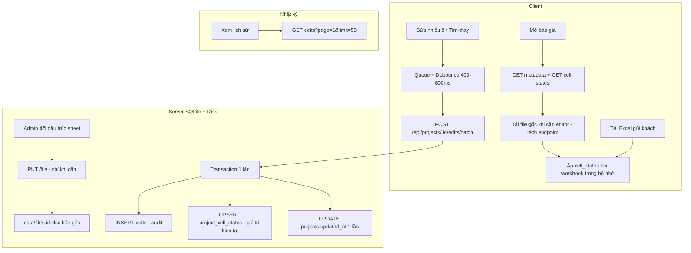

# BÁO CÁO PHÂN TÍCH VÀ KẾ HOẠCH TỐI ƯU CƠ SỞ DỮ LIỆU KHI CHỈNH SỬA DỮ LIỆU LỚN

> **Dự án**: Hệ Thống Quản Lý Báo Giá Đo Đạc - Phúc Gia (BaoGiaPhucGia)  
> **Tài liệu**: Kế hoạch giải quyết tắc nghẽn Database & Quá tải dữ liệu khi chỉnh sửa  
> **Ngày lập**: 2026-10-07  
> **Cập nhật**: 2026-10-07 — rà soát lại so với code; bổ sung giải thích tiếng Việt thuần cho thực tập / fresher

---

## Dành cho người mới đọc tài liệu này

Tài liệu này trả lời 3 câu hỏi:

1. **Hệ thống đang chạy thế nào?** (ai sửa gì, dữ liệu nằm đâu)
2. **Vì sao bị chậm / sai khi sửa nhiều?**
3. **Sẽ sửa theo thứ tự nào?** (checklist từ dễ/gấp đến khó)

Mỗi mục kỹ thuật đều có khung **Giải thích dễ hiểu** ngay bên dưới.

### Từ điển ngắn (gặp từ lạ thì xem đây)

| Từ kỹ thuật | Nghĩa thuần Việt |
|-------------|------------------|
| **Bản gốc / master file** | File Excel “mẫu” admin upload lên server. Nhân viên không được ghi đè file này. |
| **Edits / nhật ký sửa** | Mỗi lần ai đó đổi một ô, hệ thống ghi lại một dòng: ô nào, cũ → mới, ai sửa, lúc nào. |
| **Replay** | Khi mở lại báo giá, lấy file gốc rồi “chạy lại” các lần sửa đã ghi để hiện đúng số nhân viên đã điền. |
| **Base64** | Cách nhét cả file Excel vào chuỗi chữ để gửi qua API. File càng nặng, chuỗi càng dài → chậm. |
| **Batch** | Gửi nhiều thay đổi trong **một lần** thay vì gửi từng cái một. |
| **Debounce** | Đợi người dùng ngừng gõ một chút rồi mới gửi lên server, tránh gửi liên tục. |
| **Index (chỉ mục DB)** | Như mục lục sách: giúp tìm dữ liệu theo project/ngày nhanh hơn, không phải lật từng trang. |
| **Pagination / phân trang** | Chỉ lấy 50 dòng/lần khi xem nhật ký, không tải cả ngàn dòng một lúc. |
| **`project_cell_states`** | Bảng mới đề xuất: chỉ lưu **giá trị mới nhất của mỗi ô**. Muốn biết ô C10 hiện là gì thì đọc 1 dòng, không cần đọc cả lịch sử. |
| **Transaction** | Gói nhiều câu lệnh SQL thành “một việc”: hoặc thành công hết, hoặc thất bại hết — tránh nửa đường bị lỗi. |
| **UPSERT** | Có rồi thì cập nhật, chưa có thì thêm mới. |
| **Overfetch** | Tải về nhiều hơn mức cần dùng (ví dụ chỉ cần tên báo giá mà lại tải cả file Excel). |
| **N+1 requests** | Việc lẽ ra 1 lần gọi API thì lại gọi N lần (ví dụ sửa 200 ô → 200 lần gọi). |
| **Bottleneck** | Điểm nghẽn: chỗ làm cả hệ thống chậm lại. |
| **Migration / backfill** | Script chạy một lần để chuyển dữ liệu cũ sang cấu trúc mới. |
| **Compaction** | Dọn nhật ký cũ cho gọn DB — chỉ làm khi đã có cách khác để biết giá trị hiện tại. |
| **await** | Trong JS/TS: đợi thao tác bất đồng bộ (ghi file) xong rồi mới làm tiếp. Thiếu await = báo “xong” sớm khi chưa ghi xong. |

---

## MỤC LỤC
1. [Nghiệp vụ hiện tại (cần bám)](#0-nghiệp-vụ-hiện-tại-cần-bám)
2. [Hiện trạng & Nguyên nhân Gây Quá Tải](#1-hiện-trạng--nguyên-nhân-gây-quá-tải)
3. [Bug chức năng phải sửa trước / cùng tối ưu](#2-bug-chức-năng-phải-sửa-trước--cùng-tối-ưu)
4. [Mô hình Luồng Xử lý Dữ liệu Mới](#3-mô-hình-luồng-xử-lý-dữ-liệu-mới)
5. [Kế hoạch Chi tiết Từng Giai đoạn](#4-kế-hoạch-chi-tiết-từng-giai-đoạn)
6. [Lộ trình Triển khai (Checklist — theo ưu tiên)](#5-lộ-trình-triển-khai-checklist--theo-ưu-tiên)
7. [Những việc không làm / làm sau](#6-những-việc-không-làm--làm-sau)

---

## 0. Nghiệp vụ hiện tại (cần bám)

> **Giải thích dễ hiểu:**  
> Hệ thống không phải “ai cũng ghi đè cùng một file Excel trên server”.  
> Admin giữ **bản mẫu**. Nhân viên **điền số vào ô được phép**, hệ thống **ghi nhật ký**, rồi nhân viên **tải file Excel về máy** để gửi khách. File mẫu trên server vẫn nguyên.

Hai pipeline **khác nhau** — mọi tối ưu phải tôn trọng:

| Vai trò | Bản gốc trên server (`data/files/{id}.xlsx`) | Chỉnh sửa giá trị ô | Kết quả gửi khách |
|--------|-----------------------------------------------|---------------------|-------------------|
| **Admin / Manager** | Upload, cấu hình vùng sửa, thêm/xóa dòng-cột (có thể PUT file) | Nên **không** ghi đè bản gốc chỉ vì sửa 1 ô (xem Giai đoạn 3) | Theo dõi nhật ký nhân viên điền |
| **User** | **Không** ghi đè | Chỉ `INSERT` vào `edits` (sau này + `project_cell_states`) | **Tải Excel** (master + áp edits/cell_states trên client) |

> **Giải thích bảng trên:**  
> - Cột “Bản gốc”: file mẫu nằm trên máy chủ.  
> - Cột “Chỉnh sửa giá trị ô”: nhân viên đổi số/chữ trong ô được mở quyền → chỉ ghi nhật ký, không đè file mẫu.  
> - Cột “Gửi khách”: nhân viên bấm tải Excel; máy tính ghép file mẫu + các ô đã điền rồi tải về.

Trạng thái theo dõi (không phải workflow duyệt phức tạp):

- `nhap` (Mới giao) → `dang_lam` (Đang điền) → `da_gui` (Đã gửi khách)
- Legacy `cho_duyet` / `da_duyet` vẫn có thể tồn tại trong DB cũ → normalize về 3 trạng thái trên UI

> **Giải thích dễ hiểu:**  
> Trạng thái chỉ để biết báo giá đang ở bước nào (mới giao / đang làm / đã gửi).  
> Không còn chuỗi “chờ duyệt → đã duyệt” phức tạp như bản cũ.  
> Dữ liệu cũ còn chữ `cho_duyet` / `da_duyet` thì giao diện sẽ **đổi về** 3 trạng thái trên cho đồng bộ.

**Không** quay lại mô hình “user ghi đè file gốc” hay “snapshot khi duyệt” trừ khi nghiệp vụ đổi.

> **Giải thích dễ hiểu:**  
> Đừng tự ý code lại kiểu “lưu đè file gốc khi nhân viên sửa”. Đó là hướng đã bỏ vì trái quy trình công ty.

---

## 1. Hiện trạng & Nguyên nhân Gây Quá Tải

Sau khi rà soát `server/db.ts`, `server.ts`, `server/files.ts`, `UserDashboard.tsx`, `AdminDashboard.tsx`, `SpreadsheetViewer`:

> **Giải thích dễ hiểu:**  
> Phần này liệt kê **chỗ đang làm chậm / nặng**. Không phải toàn bộ là “bug sai số”, một số chỉ là thiết kế chưa tối ưu khi dữ liệu lớn.

### 1.1. Tình trạng "N+1 Requests" khi Tìm kiếm & Thay thế (đúng)
- **Vấn đề**: `handleSearchReplace` trong `UserDashboard.tsx` duyệt mảng và `for (const edit of newEdits) await api.saveEdit(...)`.
- **Hậu quả**: Thay 100–500 ô → 100–500 HTTP request nối tiếp; mỗi request = `INSERT edits` + `UPDATE projects.updated_at` → khóa SQLite, waterfall mạng, UI chậm.

> **Giải thích dễ hiểu:**  
> Ví dụ: tìm chữ “A” thay bằng “B” trên 300 ô. Hiện tại app gửi **300 lần** “ơi server, lưu giúp 1 ô”.  
> Đúng hơn là gửi **1 lần**: “ơi server, lưu giúp cả 300 ô này”.  
> Giống mua 300 món: mang 300 lần lên quầy vs mang 1 giỏ một lần.

### 1.2. Overfetching lịch sử edits không phân trang (đúng)
- **Vấn đề**: `GET /api/projects/:id/edits` lấy toàn bộ:
  ```sql
  SELECT * FROM edits WHERE project_id = ? ORDER BY timestamp DESC;
  ```
- **Hậu quả**: Hàng chục nghìn dòng JSON mỗi lần mở / xem nhật ký → tốn RAM Node + đơ UI.

> **Giải thích dễ hiểu:**  
> Nhật ký sửa giống cuốn sổ dày. Hiện tại mỗi lần mở là **đọc cả cuốn** mang về trình duyệt.  
> Phân trang = chỉ lấy **50 dòng gần nhất**, cần nữa mới lấy trang sau. Nhẹ hơn nhiều.

### 1.3. Ghi đè Base64 khi Admin sửa ô (đúng — chỉ pipeline Admin)
- **Vấn đề**: Trong `AdminDashboard.tsx` → `handleCellEdit`:
  1. `POST .../edits`
  2. Xuất toàn bộ workbook ExcelJS → Base64 (vài MB–chục MB)
  3. `PUT /api/projects/:id/file` ghi đè `.xlsx` trên disk
- **Lưu ý**: **User không làm vậy.** User chỉ log edits rồi tải file cục bộ. Doc cũ dễ hiểu nhầm “mọi lần sửa ô đều serialize file” — chỉ đúng với admin cell edit / thao tác cấu trúc.
- **Hậu quả (admin)**: CPU ExcelJS + băng thông + Disk I/O không cần thiết cho việc chỉ đổi giá trị một ô trên bản gốc.

> **Giải thích dễ hiểu:**  
> Admin sửa **một ô** nhưng hệ thống đang: đóng gói **cả file Excel** thành chuỗi khổng lồ rồi gửi lên ghi đè file mẫu.  
> Giống sửa một chữ trong sách mà photocopy lại cả cuốn rồi thay cuốn cũ.  
> Nhân viên sửa ô thì **không** làm chuyện này — chỉ ghi nhật ký. Đừng nhầm hai luồng.

### 1.4. Overfetch file gốc mỗi lần mở project (thiếu trong bản doc cũ — quan trọng)
- **Vấn đề**: `GET /api/projects/:id` (và nhiều response khác) luôn gọi `projectWithFile` → đọc cả file Excel → Base64.
- **Hậu quả**: Với file lớn, đây thường nặng hơn JSON edits. Tối ưu edits/`cell_states` mà vẫn tải full Base64 mỗi lần mở thì bottleneck chính vẫn còn.

> **Giải thích dễ hiểu:**  
> Bạn chỉ cần xem tên báo giá / trạng thái, nhưng API vẫn gửi kèm **cả file Excel** (có thể vài chục MB).  
> Giống hỏi “báo giá này tên gì?” mà người kia gửi cả cặp tài liệu.  
> Nên tách: hỏi thông tin thì chỉ nhận thông tin; vào sửa bảng tính mới tải file.

### 1.5. Thiếu Index & schema ID lệch kiểu (đúng)
- Bảng `edits` chưa có index `(project_id, timestamp)`, `(project_id, user_id)`.
- `CREATE TABLE projects` khai `id INT PRIMARY KEY` nhưng runtime dùng `newId()` dạng string (`1741...-abc`) → nên chuẩn hóa `id TEXT`.

> **Giải thích dễ hiểu:**  
> - **Thiếu index:** Tìm nhật ký của một báo giá mà không có mục lục → DB phải quét hết bảng. Có index = tìm nhanh.  
> - **ID lệch kiểu:** Khai báo “ID là số” nhưng thực tế đang lưu “chuỗi kiểu `1741-abc`”. Nên khai cho khớp (`TEXT`) để tránh lỗi khó đoán sau này.

---

## 2. Bug chức năng phải sửa trước / cùng tối ưu

Các mục dưới đây là **sai dữ liệu / cộng tác**, không chỉ “chậm”. Làm batch/`cell_states` mà bỏ qua sẽ vẫn lỗi nghiệp vụ.

> **Giải thích dễ hiểu:**  
> Phần 1 là “chậm / nặng”. Phần 2 là “**sai hoặc thiếu dữ liệu**”.  
> Ưu tiên sửa phần 2 trước hoặc cùng lúc, vì tối ưu tốc độ mà số liệu hiện sai thì vẫn không dùng được.

### 2.1. Replay edits theo `ORDER BY timestamp DESC` (nghiêm trọng)
- Client `applyEditsToWorkbook` apply theo thứ tự mảng.
- API trả **mới → cũ** → ô sửa nhiều lần có thể hiện **giá trị cũ** sau khi mở lại.
- **Sửa**: trả edits theo `ASC` khi dùng để replay, hoặc dedupe theo `(sheet, cell)` lấy bản mới nhất; lịch sử UI có thể vẫn DESC có phân trang.

> **Giải thích dễ hiểu:**  
> Ô C10 bạn sửa: 10 → 20 → 30. Khi mở lại, hệ thống “chạy lại” các lần sửa.  
> Nếu chạy từ **mới về cũ** (30 rồi 20 rồi 10), kết thúc lại thành **10** — sai.  
> Đúng là chạy từ **cũ đến mới**, hoặc chỉ lấy **lần sửa cuối** của mỗi ô.  
> (Xem nhật ký trên UI vẫn có thể hiện mới nhất trước — đó là chuyện giao diện, khác với chuyện dựng lại số liệu.)

### 2.2. User chỉ thấy edits của chính mình (nghiêm trọng với dự án nhiều NV)
- Server: role `user` → `WHERE project_id = ? AND user_id = ?`.
- Hệ quả: member A không thấy ô member B đã điền; export thiếu dữ liệu đồng nghiệp.
- **Sửa**: member của project đọc được **toàn bộ** cell states / edits của project (vẫn giới hạn theo `userCanAccessProject`). Audit log admin có thể giữ filter/phân trang riêng nếu cần.

> **Giải thích dễ hiểu:**  
> Một báo giá giao cho 2–3 nhân viên cùng làm. Hiện tại mỗi người **chỉ thấy ô mình sửa**.  
> A mở ra không thấy số B đã điền → tải Excel gửi khách sẽ **thiếu**.  
> Đúng ra: ai được gán vào báo giá đó thì thấy **toàn bộ** ô đã điền của báo giá (vẫn không thấy báo giá không được gán).

### 2.3. `saveProjectFile` không `await` trên `PUT .../file` (trung bình)
- API có thể trả 200 trước khi ghi xong disk → race đọc ngay sau ghi.
- **Sửa**: `await saveProjectFile(...)`.

> **Giải thích dễ hiểu:**  
> Server báo “đã lưu xong” trong khi file trên ổ cứng **chưa ghi xong**.  
> Client tải lại ngay → đôi khi lấy bản cũ.  
> Thêm `await` = đợi ghi file thật sự xong rồi mới trả lời “OK”.

### 2.4. Hai nguồn sự thật: master file + edits log (trung bình)
- Admin sửa ô vừa ghi log vừa ghi đè master; user chỉ log.
- Khi thêm `project_cell_states` phải **thống nhất**:
  - Master = template/cấu trúc do admin quản lý.
  - Giá trị ô do user (và admin khi sửa giá trị) → `cell_states` (+ `edits` audit).
  - Không bake giá trị user vào master trừ khi có quyết định nghiệp vụ rõ ràng.

> **Giải thích dễ hiểu:**  
> Hiện có hai chỗ cùng “nói” về dữ liệu:  
> 1) File Excel gốc trên đĩa  
> 2) Nhật ký sửa trong database  
> Admin đôi khi sửa cả hai; user chỉ sửa nhật ký. Dễ lệch nhau.  
> Hướng thống nhất:  
> - File gốc = khung/mẫu (do admin)  
> - Số nhân viên điền = lưu ở `cell_states` (+ nhật ký để soi lại)  
> Đừng “nướng” số của nhân viên vào file mẫu trừ khi sếp yêu cầu rõ.

### 2.5. Thêm/xóa dòng-cột (admin) vs tọa độ ô trong log (trung bình / dễ bỏ sót)
- Edits/`cell_states` lưu địa chỉ kiểu `C10`. Admin chèn/xóa dòng → địa chỉ lệch.
- Cần chiến lược: remap khi cấu trúc đổi, hoặc khóa cấu trúc khi đã có người điền, hoặc cảnh báo + invalidation có kiểm soát.

> **Giải thích dễ hiểu:**  
> Nhật ký nhớ “ô C10 = 500”. Admin chèn thêm 1 dòng phía trên → ô chứa 500 có thể thành C11, nhưng nhật ký vẫn nói C10.  
> Kết quả: số nhảy nhầm chỗ.  
> Cần một trong các cách: dời địa chỉ trong DB khi admin đổi cấu trúc, hoặc cấm đổi cấu trúc khi đã có người điền, hoặc cảnh báo rõ + xử lý có kiểm soát.

### 2.6. Feature chết: Version snapshot / VersionPanel
- `saveVersionSnapshot` / bảng `versions` gần như không được ghi trong luồng status hiện tại.
- **Không** nhét lại “snapshot khi `da_duyet`” vào plan tối ưu trừ khi nghiệp vụ mới yêu cầu.

> **Giải thích dễ hiểu:**  
> Trước có ý tưởng “mỗi lần duyệt thì chụp một bản Excel lưu lại”. Code lưu/đọc còn đó nhưng **luồng hiện tại hầu như không chụp**.  
> Đừng bỏ công làm lại tính năng này trong đợt tối ưu tốc độ, trừ khi sau này công ty muốn lưu bản đã gửi khách trên server.

---

## 3. Mô hình Luồng Xử lý Dữ liệu Mới

> **Giải thích dễ hiểu (nhìn sơ đồ):**  
> 1) Người dùng sửa nhiều ô → đợi một chút (debounce) → gửi **một gói** lên server.  
> 2) Server ghi nhật ký + cập nhật “giá trị hiện tại từng ô” trong **một transaction**.  
> 3) Mở báo giá: lấy thông tin nhẹ + danh sách ô đã điền; file Excel gốc chỉ tải khi thật sự vào bảng tính.  
> 4) Tải Excel gửi khách: ghép file gốc + các ô đã điền trên máy người dùng.



**Nguyên tắc đọc**:
1. Giá trị đã điền lấy từ `project_cell_states` (nhẹ), không quét full edit log để dựng state.
2. File gốc vẫn cần cho format/merge/cấu trúc — nhưng **không** nhồi Base64 vào mọi API metadata.
3. Export của user = master (disk) + áp `cell_states` trên client (hoặc endpoint export server sau này).

> **Giải thích dễ hiểu từng nguyên tắc:**  
> 1) Hỏi “ô này hiện bao nhiêu?” → đọc bảng trạng thái ô, đừng đọc cả cuốn nhật ký.  
> 2) File gốc vẫn cần để giữ màu, ô gộp, cột… nhưng đừng gửi kèm mọi lúc.  
> 3) Khi tải gửi khách: lấy mẫu + đắp số đã điền lên → ra file hoàn chỉnh trên máy nhân viên.

---

## 4. Kế hoạch Chi tiết Từng Giai đoạn

### Giai đoạn 0: Sửa bug chức năng (làm trước hoặc song song Giai đoạn 1)

> **Giải thích dễ hiểu:**  
> Giai đoạn “vá lỗi đúng/sai” trước khi “làm cho nhanh”. Làm nhanh trên dữ liệu sai thì vẫn sai.

1. Replay: `ASC` hoặc dedupe latest-per-cell khi dựng workbook.  
   > *Dễ hiểu:* Khi dựng lại bảng, chạy sửa từ cũ→mới, hoặc chỉ lấy lần sửa cuối mỗi ô.
2. Member cùng project đọc được edits/cell_states của cả project (không chỉ `user_id` của mình).  
   > *Dễ hiểu:* Đồng nghiệp cùng báo giá phải thấy số nhau đã điền.
3. `await saveProjectFile` trên `PUT .../file`.  
   > *Dễ hiểu:* Đợi ghi file xong mới báo thành công.
4. Làm rõ trong code comment: user không PUT file; admin PUT file chỉ cho cấu trúc / upload gốc.  
   > *Dễ hiểu:* Viết chú thích trong code để fresher sau này không vô tình cho user ghi đè file mẫu.

### Giai đoạn 1: Nâng cấp Schema & Indexing (SQLite)

> **Giải thích dễ hiểu:**  
> Sửa “khung nhà kho” dữ liệu: thêm mục lục tìm nhanh, thêm kệ riêng cho “giá trị hiện tại từng ô”, sửa kiểu ID cho khớp thực tế, rồi chuyển dữ liệu cũ sang kệ mới.

1. **Index `edits`**:
   ```sql
   CREATE INDEX IF NOT EXISTS idx_edits_project_timestamp ON edits(project_id, timestamp DESC);
   CREATE INDEX IF NOT EXISTS idx_edits_project_user ON edits(project_id, user_id);
   ```
   > *Dễ hiểu:* Tạo mục lục theo báo giá + thời gian / người sửa để truy vấn nhật ký nhanh hơn.

2. **Bảng `project_cell_states`** (trạng thái mới nhất mỗi ô):
   ```sql
   CREATE TABLE IF NOT EXISTS project_cell_states (
     project_id TEXT NOT NULL,
     sheet_name TEXT NOT NULL,
     cell TEXT NOT NULL,
     value TEXT,
     updated_by TEXT NOT NULL,
     updated_at TEXT NOT NULL,
     PRIMARY KEY (project_id, sheet_name, cell),
     FOREIGN KEY (project_id) REFERENCES projects(id) ON DELETE CASCADE
   );
   CREATE INDEX IF NOT EXISTS idx_cell_states_project ON project_cell_states(project_id);
   ```
   > *Dễ hiểu:* Mỗi ô chỉ giữ **1 dòng giá trị mới nhất**. Ô C10 đổi 50 lần vẫn chỉ còn 1 dòng “C10 = giá trị hiện tại”. Nhật ký `edits` vẫn giữ để soi lịch sử nếu cần.

3. **Chuẩn hóa `projects.id`**: `TEXT PRIMARY KEY` (migration DB cũ nếu cần).  
   > *Dễ hiểu:* Khai báo ID là chữ (string) cho đúng với ID đang dùng trong app.

4. **Migration dữ liệu**: backfill `project_cell_states` từ `edits` (mỗi `(project_id, sheet_name, cell)` lấy bản `timestamp` mới nhất). Không bật compaction trước bước này.  
   > *Dễ hiểu:* Chạy script một lần: đọc nhật ký cũ, với mỗi ô lấy lần sửa cuối, đổ vào bảng mới. **Chưa được xóa nhật ký cũ** cho đến khi bước này ổn.

### Giai đoạn 2: API Batch, Cell-states, Pagination

> **Giải thích dễ hiểu:**  
> Làm các “cửa giao hàng” mới trên server: nhận nhiều sửa một lần, trả giá trị hiện tại từng ô, trả nhật ký theo trang, tách tải file Excel ra API riêng.

1. **`POST /api/projects/:id/edits/batch`**
   - Payload:
     ```json
     {
       "edits": [
         { "sheetName": "BaoGia", "cell": "C10", "oldValue": "100", "newValue": "200" },
         { "sheetName": "BaoGia", "cell": "C11", "oldValue": "50", "newValue": "80" }
       ]
     }
     ```
   - Một `db.transaction`: batch `INSERT edits` + `INSERT OR REPLACE project_cell_states` + `UPDATE projects.updated_at` **một lần**.
   - Tôn trọng khóa `da_gui` (và legacy `da_duyet`) với non-admin.

   > *Dễ hiểu:* Một request mang theo danh sách ô cần lưu. Server ghi nhật ký + cập nhật giá trị hiện tại + cập nhật giờ sửa **trong một giao dịch**. Báo giá đã “đã gửi khách” thì nhân viên không sửa tiếp (trừ khi admin mở lại).

2. **`GET /api/projects/:id/cell-states`**
   - Trả map/list ô đã đổi so với gốc; mọi member được gán đều đọc được.
   - Dùng khi mở editor thay cho full edit log.

   > *Dễ hiểu:* API hỏi “những ô nào đã được điền, giá trị hiện tại là gì?” — nhẹ, đủ để hiện bảng. Ai được gán báo giá đều đọc được.

3. **`GET /api/projects/:id/edits?page=&limit=`**
   - Mặc định `page=1`, `limit=50`.
   - Response: `{ items, total, page, totalPages }`.
   - Dùng cho tab nhật ký; **không** dùng full list để replay nếu đã có cell-states.

   > *Dễ hiểu:* Tab “nhật ký” chỉ tải từng trang 50 dòng. Không còn dùng cả nhật ký để dựng lại bảng nếu đã có `cell_states`.

4. **(Khuyến nghị cùng giai đoạn) Tách tải file**
   - `GET /api/projects/:id` → metadata không kèm Base64 (hoặc flag `?includeFile=0|1`).
   - `GET /api/projects/:id/file` → Base64 / binary khi vào editor.
   - Tránh trả file trong mọi `PATCH` / `status`.

   > *Dễ hiểu:* Đổi trạng thái / sửa tên báo giá **không** cần gửi kèm cả file Excel. Chỉ khi mở bảng tính mới tải file.

### Giai đoạn 3: Tối ưu Client

> **Giải thích dễ hiểu:**  
> Sửa phần giao diện / trình duyệt: gom lệnh gửi, đợi ngừng gõ rồi gửi, admin thôi không gửi cả file mỗi lần sửa một ô.

1. Search/Replace → `api.saveBatchEdits` (một request).  
   > *Dễ hiểu:* Thay thế hàng loạt chỉ gọi API một lần.
2. Debounce queue 400–600ms khi gõ nhiều ô liên tiếp → batch.  
   > *Dễ hiểu:* Người dùng sửa liên tục 5 ô trong nửa giây → đợi ~0,5 giây im rồi gửi một gói, không gửi 5 lần.
3. **Admin `handleCellEdit`**: chỉ batch/edits + cell_states; **không** `updateProjectFile` khi chỉ đổi giá trị ô.  
   > *Dễ hiểu:* Admin sửa số trong ô cũng chỉ lưu nhật ký/trạng thái ô như user — không đóng gói cả Excel.
4. Admin vẫn `PUT /file` khi: upload mới, thêm/xóa dòng-cột, thao tác cấu trúc có chủ đích (“Lưu cấu trúc”).  
   > *Dễ hiểu:* Chỉ khi đổi khung bảng (thêm dòng, xóa cột, upload file mới) mới ghi đè file mẫu.
5. Mở project: metadata + cell-states (+ file endpoint); áp cell_states lên workbook trong `SpreadsheetViewer` / dashboard.  
   > *Dễ hiểu:* Mở báo giá = lấy thông tin + ô đã điền + (nếu cần) file mẫu, rồi đắp số lên bảng trên màn hình.

### Giai đoạn 4: Compaction (chỉ sau khi đọc không phụ thuộc full log)

> **Giải thích dễ hiểu:**  
> Giai đoạn “dọn sổ nhật ký cũ” cho DB gọn. **Chỉ làm khi** hệ thống đã không cần đọc hết nhật ký để biết số hiện tại. Làm sớm = có thể mất dữ liệu trên màn hình.

1. Khi mọi đường hiển thị/export đã dùng `cell_states`, mới cân nhắc:
   - Gom/xóa edits trung gian cũ hơn N ngày (ví dụ 90 ngày), **giữ** ít nhất 1 bản audit gần nhất mỗi ô nếu vẫn cần lịch sử chi tiết; hoặc archive sang bảng/file riêng.
   > *Dễ hiểu:* Nhật ký ô C10 có 100 dòng trung gian cũ → có thể dọn, nhưng vẫn biết C10 hiện là bao nhiêu nhờ `cell_states`.
2. **Không** làm compaction nếu UI/admin vẫn `SELECT * FROM edits` để dựng state.  
   > *Dễ hiểu:* Nếu app vẫn dựng bảng từ nhật ký thì đừng xóa nhật ký.
3. Snapshot version khi đổi status: **không** nằm trong scope tối ưu hiện tại (nghiệp vụ đã bỏ duyệt/snapshot). Chỉ mở lại nếu product yêu cầu lưu bản đã gửi khách phía server.  
   > *Dễ hiểu:* Đợt này không làm “chụp bản Excel mỗi lần đổi trạng thái” trừ khi sau này công ty yêu cầu.

---

## 5. Lộ trình Triển khai (Checklist — theo ưu tiên)

> **Giải thích dễ hiểu:**  
> Làm lần lượt từ trên xuống. Mỗi dòng là một việc có thể giao cho thực tập/fresher (kèm mentor review). Tick `[x]` khi xong và đã kiểm thử.

- [ ] **Bước 0a**: Sửa thứ tự replay edits (`ASC` / dedupe latest cell).  
  > *Việc làm:* Đảm bảo mở lại báo giá luôn hiện **giá trị mới nhất** của mỗi ô.
- [ ] **Bước 0b**: Cho member cùng project đọc edits/cell_states của cả project.  
  > *Việc làm:* 2 nhân viên cùng báo giá phải thấy đủ ô nhau đã điền.
- [ ] **Bước 0c**: `await saveProjectFile` trên `PUT .../file`.  
  > *Việc làm:* Sửa 1 dòng thiếu `await` — nhỏ nhưng quan trọng.
- [ ] **Bước 1**: `server/db.ts` — index `edits`, bảng `project_cell_states`, `projects.id TEXT`, script backfill từ edits.  
  > *Việc làm:* Sửa database + chuyển dữ liệu cũ sang bảng trạng thái ô.
- [ ] **Bước 2**: `server.ts` — `POST .../edits/batch`, `GET .../cell-states`, `GET .../edits` phân trang; (khuyến nghị) tách `GET .../file`.  
  > *Việc làm:* Thêm API mới trên server theo thiết kế giai đoạn 2.
- [ ] **Bước 3**: `src/lib/api.ts` — `saveBatchEdits`, `getCellStates`, cập nhật `getEdits` có page/limit.  
  > *Việc làm:* Viết hàm phía frontend gọi đúng API mới.
- [ ] **Bước 4**: `UserDashboard` — Search/Replace + debounce dùng batch; mở project dùng cell-states.  
  > *Việc làm:* Màn nhân viên gửi sửa theo lô, mở báo giá nhẹ hơn.
- [ ] **Bước 5**: `AdminDashboard` — bỏ PUT Base64 trong `handleCellEdit`; giữ PUT file cho cấu trúc.  
  > *Việc làm:* Admin sửa ô không còn gửi cả file; chỉ còn gửi file khi đổi cấu trúc.
- [ ] **Bước 6**: Giảm trả Base64 không cần thiết trên metadata/status APIs.  
  > *Việc làm:* Đổi tên / đổi trạng thái không kèm file Excel.
- [ ] **Bước 7**: Kiểm thử: 100–1000 ô batch; 2 user cùng project thấy đủ ô; mở lại đúng giá trị mới nhất; admin thêm dòng không phá dữ liệu (hoặc có cảnh báo rõ).  
  > *Việc làm:* Kiểm thử tay / checklist trước khi coi là xong.
- [ ] **Bước 8** (sau ổn định): Compaction edits cũ — tùy chọn.  
  > *Việc làm:* Chỉ dọn nhật ký cũ khi mentor xác nhận hệ thống đã ổn định.

---

## 6. Những việc không làm / làm sau

> **Giải thích dễ hiểu:**  
> Đây là danh sách “đừng tự làm vì tưởng hay”. Tránh lệch nghiệp vụ hoặc phá dữ liệu.

| Không làm ngay | Lý do | Giải thích dễ hiểu |
|----------------|--------|---------------------|
| Quay lại user ghi đè file gốc / “Lưu bản sao” như bản gốc mới | Trái nghiệp vụ đã chốt | Nhân viên chỉ điền + tải về; không đè mẫu trên server |
| Snapshot tự động khi `da_duyet` / gắn Phase 4 vào duyệt | Workflow đã rút gọn; feature versions đang chết | Đừng làm lại chức năng duyệt/chụp bản đã bỏ |
| Xóa edits > 90 ngày trước khi cell_states + backfill ổn định | Mất dữ liệu hiển thị | Xóa sổ cũ khi chưa có bảng giá trị hiện tại = mất số trên màn hình |
| Chỉ làm debounce mà không bỏ admin PUT file mỗi ô | Bottleneck Base64 admin vẫn còn | Chỉ “gom gửi” mà admin vẫn gửi cả file mỗi ô thì vẫn chậm |
| Chỉ tối ưu edits mà bỏ qua tách tải file gốc | File Base64 vẫn là bottleneck chính khi mở project | Sửa nhật ký mà vẫn tải cả Excel mỗi lần mở = chưa xử lý chỗ nặng nhất |

---

## Tóm tắt đánh giá (sau rà soát code)

- **Hướng tối ưu trong doc gốc (batch, index, cell_states, pagination)**: đúng và nên làm.  
  > *Dễ hiểu:* Gom gửi, thêm mục lục DB, lưu giá trị hiện tại từng ô, xem nhật ký theo trang — các hướng này đúng bài.
- **Chỗ lệch**: nhầm pipeline user/admin về serialize Base64; thiếu overfetch file gốc; Phase 4 snapshot/`da_duyet` lỗi thời.  
  > *Dễ hiểu:* Bản thảo cũ lẫn chuyện nhân viên/admin; thiếu phần “mỗi lần mở lại tải cả file”; phần chụp bản khi duyệt không còn khớp quy trình.
- **Thiếu sót quan trọng đã bổ sung**: bug `DESC` replay, visibility multi-user, `await` ghi file, dual source of truth, remap khi đổi cấu trúc sheet, tách API file.  
  > *Dễ hiểu:* Đã bổ sung các lỗi “sai số / thiếu số đồng nghiệp / báo lưu sớm / hai nguồn dữ liệu / lệch ô khi thêm dòng / nên tách tải file”.

**Không push** — tài liệu này chỉ để triển khai nội bộ theo checklist trên.

---

## Gợi ý mentor khi giao việc cho thực tập / fresher

1. Cho đọc **mục 0 + từ điển** trước khi đụng code.  
2. Việc đầu nên giao: **Bước 0a / 0c** (nhỏ, dễ review).  
3. Không giao **Bước 8 compaction** cho người mới.  
4. Mỗi PR chỉ làm **một bước checklist**; kèm bước kiểm thử tay tương ứng ở Bước 7.  
5. Trước khi merge: xác nhận không phá quy tắc “user không ghi đè bản gốc”.
