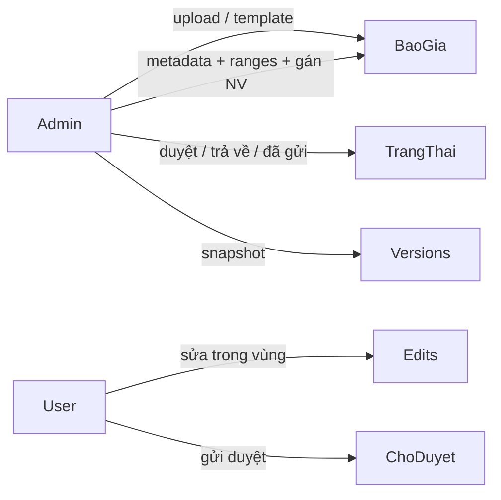

# Kế hoạch triển khai Báo Giá Phúc Gia (nghiệp vụ)

Tài liệu checklist khi code và deploy. Cập nhật `[x]` khi hoàn thành từng mục.

## Hiện trạng ban đầu (prototype)

| Lớp | Công nghệ | Ghi chú |
|-----|-----------|---------|
| Frontend | React 19, Vite, Tailwind, shadcn/ui | `src/App.tsx`, dashboards |
| Backend | Express trong `server.ts` | API + serve Vite/static |
| Excel | `xlsx` + `exceljs` | Giữ format/merge khi sửa |
| Auth | Login đơn giản, role `admin` / `user` | Hardcode in-memory |
| Lưu trữ | In-memory | Mất hết khi restart |

**Đã có:** upload Excel, vùng sửa (`editableRanges`), thêm/xóa dòng-cột, audit log, user sửa ô / tìm-thay / xuất / ghi đè / lưu bản sao.

## Nguyên tắc

1. Nghiệp vụ trước, Phase 0 chỉ làm nền tối thiểu (disk + SQLite + auth).
2. Tận dụng luồng Excel hiện có — không viết lại editor.
3. Mỗi phase demo độc lập trên VPS nội bộ.
4. Không dùng Gemini trừ khi cần AI sau này.

## Luồng nghiệp vụ mục tiêu

---

## Phase 0 — Nền tối thiểu

- [x] Lưu file Excel trên disk (`data/files/{id}.xlsx`)
- [x] Metadata + edits + users trong SQLite (`data/baogia.db`)
- [x] Token auth sau login; middleware kiểm tra role
- [x] Script production: `build` + `start` chạy được trên Node

**File:** `server.ts`, `server/db.ts`, `server/auth.ts`, `server/files.ts`, `src/lib/api.ts`, `src/lib/auth.tsx`, `package.json`

---

## Phase 1 — Nghiệp vụ báo giá cốt lõi

- [x] Trường: `soBaoGia`, `tenKhachHang`, `nguoiPhuTrachId`, `trangThai`, `ghiChu`, `version`, `updatedAt`
- [x] Admin: sửa metadata, xóa, đổi tên
- [x] User: chỉ thấy báo giá được gán
- [x] Tìm kiếm / lọc trạng thái
- [x] Branding **Báo Giá Phúc Gia**, UI tiếng Việt

**API:** `PATCH /api/projects/:id`, `DELETE /api/projects/:id`, `GET /api/projects?q=&status=&assignee=`

---

## Phase 2 — Phân quyền & quản lý người dùng

- [x] CRUD user (admin): username, password hash, role, active
- [x] Gán nhiều nhân viên (`project_members`)
- [x] Khóa sửa khi `da_duyet` / `da_gui` (admin mở lại được)
- [x] Ẩn quick-login khi `NODE_ENV=production`

---

## Phase 3 — Trạng thái (theo dõi, không ghi đè bản gốc)

- [x] `nhap` (Mới giao) → `dang_lam` (Đang điền) → `da_gui` (Đã gửi khách)
- [x] Bản gốc chỉ admin cấu hình vùng sửa + gán NV
- [x] Nhân viên điền ô được phép (nhật ký edits), tải Excel gửi khách
- [x] Không ghi đè / không lưu bản sao file gốc
- [x] Badge số báo giá đang điền (admin)

Admin có thể mở lại từ `da_gui` → `dang_lam`.

---

## Phase 4 — Tiện ích nghiệp vụ

- [x] Thư viện template (clone thành báo giá mới)
- [x] Xuất PDF (in HTML preview)
- [x] Chọn vùng sửa nâng cao (kéo chọn ô)
- [ ] (Tuỳ chọn) Comment ô / Gemini — chưa bắt buộc

---

## Phase 5 — Deploy VPS Windows

Xem chi tiết: [DEPLOY_VPS.md](./DEPLOY_VPS.md)

- [x] `npm run build` + PM2 hoặc NSSM (hướng dẫn trong DEPLOY_VPS.md)
- [x] Backup thư mục `data/` định kỳ (hướng dẫn)
- [x] HTTPS reverse proxy nếu public (hướng dẫn)
- [x] Đổi mật khẩu mặc định, tắt quick-login (quick-login tắt ở production)

---

## Tài khoản mặc định (dev)

| Username | Password | Role |
|----------|----------|------|
| admin | password | admin |
| user | password | user |

**Đổi ngay trên production.**

## File chính

1. `server.ts`, `server/db.ts`, `server/auth.ts`, `server/files.ts`
2. `src/lib/api.ts`, `src/lib/auth.tsx`, `src/lib/constants.ts`, `src/lib/printPdf.ts`
3. `src/components/AdminDashboard.tsx`, `UserDashboard.tsx`, `Login.tsx`, `App.tsx`
4. `src/components/ProjectMetaForm.tsx`, `UserManagement.tsx`, `StatusWorkflow.tsx`, `VersionPanel.tsx`, `TemplateLibrary.tsx`
5. `docs/KE_HOACH_TRIEN_KHAI.md`, `docs/DEPLOY_VPS.md`
