# KẾ HOẠCH TOÀN DIỆN XỬ LÝ 11 ĐIỂM FEEDBACK TRẢI NGHIỆM THỰC TẾ
## BẢNG TÍNH BÁO GIÁ PHÚC GIA (EXCEL SPREADSHEET ENGINE V2)

---

## I. PHÂN TÍCH NGUYÊN NHÂN GỐC RỄ CHO 11 VẤN ĐỀ FEEDBACK TỪ HÌNH ẢNH

```mermaid
graph TD
    FB[11 Điểm Feedback Thực Tế] --> G1[Nhóm 1: Thao Tác Soạn Thảo & Hiển Thị]
    FB --> G2[Nhóm 2: Tìm Kiếm, Sắp Xếp & Dữ Liệu]
    FB --> G3[Nhóm 3: Định Dạng Ô, Format Painter & Font Windows]
    FB --> G4[Nhóm 4: Xuất File & Chèn Hình Ảnh]

    G1 --> F1[1. Hiển thị ô Merge trong công thức: Hiển thị đúng dải gộp G8:H8 thay vì chỉ G8]
    G1 --> F2[2. Thanh Formula Bar chuẩn Excel: Name box B8, nút X/✓/fx, Textarea soạn thảo]
    
    G2 --> F3[3. Find & Replace không tìm thấy: Univer lưu rich text cell.p, cần trích xuất textStream]
    G2 --> F4[4. Sort A-Z / Z-A không chạy: Chưa áp dụng thuật toán hoán vị dòng trên Univer Sheet]
    
    G3 --> F5[5. Hộp thoại Format Cells: Đưa Dialog Category Number, Currency, Date, Align...]
    G3 --> F6[6. Format Painter thiếu thuộc tính: Bổ sung trọn bộ font, size, border, numFmt, align]
    G3 --> F7[7. Bold/Italic không bỏ được: Cần cơ chế Toggle giữa bold <-> normal]
    G3 --> F8[8. Bổ sung Font Windows: Arial, Times New Roman, Calibri, Tahoma, Roboto...]
    G3 --> F9[9. Căn lề phải bị lỗi: Chuẩn hóa mapping HorizontalAlign.RIGHT]
    
    G4 --> F10[10. Tải về file trắng: Đọc sai cấu trúc Univer Snapshot sang ExcelJS]
    G4 --> F11[11. Chèn hình ảnh: Upload và render logo/ảnh trắc địa lên bảng tính]
```

---

### Chi Tiết Kỹ Thuật Từng Vấn Đề:

1. **Hiển thị ô đã Merge trong công thức (`=sum(` chọn ô merge)**:
   - *Hiện trạng (Hình 1)*: Khi người dùng gõ `=sum(` và click vào ô gộp `G8:H8`, công thức chỉ hiển thị `G8` dù tính toán là cả 2 ô.
   - *Nguyên nhân & Giải pháp*: Khi một ô đã gộp `G8:H8`, formula selector phải tự động phát hiện `isMerged = true` và sinh ra chuỗi dải ô `G8:H8` (hoặc `G8` kèm bounding box bao trọn cả 2 ô trên giao diện).

2. **Find & Replace không tìm thấy nội dung có thật (Hình 2 - "Bình sơn xịt")**:
   - *Nguyên nhân*: Univer lưu trữ dữ liệu cell theo nhiều dạng: `cell.v` (chuỗi thô), `cell.p` (Document Model / Rich Text Body `dataStream`), hoặc số. Hàm tìm kiếm trước đó chỉ kiểm tra `cell.v` nên khi gặp ô có rich text formatting thì bỏ qua.
   - *Giải pháp*: Xây dựng hàm `extractCellText(cell)` bóc tách toàn bộ `cell.v`, `cell.p?.body?.dataStream`, `cell.f` và chuẩn hóa tiếng Việt có dấu (Unicode Normalization NFC/NFD) để tìm kiếm chính xác 100%.

3. **Sort A $\rightarrow$ Z và Z $\rightarrow$ A không hoạt động (Hình 3)**:
   - *Nguyên nhân*: Nút bấm mới chỉ ghi log telemetry mà chưa gọi thuật toán sắp xếp các dòng trong sheet theo cột đang chọn hoặc vùng chọn.
   - *Giải pháp*: Xây dựng Sort Engine trực tiếp: lấy dữ liệu vùng chọn (hoặc từ dòng thứ 3 bỏ qua Header), sắp xếp theo cột đã chọn (hỗ trợ sắp xếp tiếng Việt `localeCompare('vi')`, số học, ngày tháng) và cập nhật lại sheet.

4. **Hộp thoại Format Cells đầy đủ (Hình 4)**:
   - *Nguyên nhân*: Chưa có modal giao diện Format Cells chuẩn Excel.
   - *Giải pháp*: Xây dựng Component `FormatCellsModal.tsx` với các Category:
     - **Number**: General, Number (số thập phân, dấu phân cách hàng nghìn), Currency (VNĐ, $), Accounting, Date (dd/mm/yyyy), Percentage (%), Text.
     - **Alignment**: Căn ngang (Trái, Giữa, Phải), Căn dọc (Trên, Giữa, Dưới), Wrap text (Ngắt dòng).
     - **Font**: Font family, Font style (Bold, Italic, Regular), Size (8 - 72), Màu chữ.
     - **Border**: Không viền, Viền ngoài, Viền trong, Đủ viền.
     - **Fill**: Màu nền ô.

5. **Thanh Formula Bar chuẩn Excel (Hình 5)**:
   - *Giải pháp*: Xây dựng component `FormulaBar.tsx`:
     - **Name Box**: Hiển thị địa chỉ ô hiện tại (`B8`) hoặc Range (`B8:D8`), cho phép nhập ô để nhảy nhanh đến ô đó.
     - **Nút điều khiển**: Nút `X` (Hủy), `✓` (Chấp nhận), `fx` (Chèn công thức).
     - **Text Area**: Soạn thảo công thức và nội dung ô dài, tự động đồng bộ 2 chiều với ô đang chọn.

6. **Format Painter lấy thiếu định dạng**:
   - *Giải pháp*: Mở rộng bộ thu thập `copiedStyle` bao gồm 100% thuộc tính: `{ fontName, fontSize, bold, italic, underline, fontColor, bgColor, horizontalAlign, verticalAlign, wrapText, numberFormat, border }`.

7. **Bold / Italic bị khóa (không Toggle tắt được)**:
   - *Nguyên nhân*: Hàm `applySelectionFormat('bold')` luôn set `bold = 'bold'`.
   - *Giải pháp*: Kiểm tra trạng thái hiện tại của ô: nếu ô đang `bold` thì chuyển về `normal`, nếu đang `normal` thì chuyển sang `bold` (Toggle 2 trạng thái).

8. **Bổ sung Danh sách Font Windows thông dụng**:
   - Tích hợp dropdown Font Selector trên Toolbar gồm: `Arial`, `Times New Roman`, `Calibri`, `Tahoma`, `Segoe UI`, `Roboto`, `Courier New`, `Verdana`, `Cambria`.

9. **Căn lề phải (Align Right) bị lỗi**:
   - *Nguyên nhân*: Univer nhận giá trị horizontal align dạng số `3` hoặc string `right`.
   - *Giải pháp*: Áp dụng cả API `setHorizontalAlignment(3)` và cập nhật style property `ht: 3` đảm bảo text dạt sát lề phải.

10. **Tải về file trống (không có dữ liệu)**:
    - *Nguyên nhân*: Hàm `exportUniverToExcelFile` đọc trực tiếp `snapshot` từ `ws.getSnapshot()` nhưng Univer chưa flush buffer sang snapshot.
    - *Giải pháp*: Duyệt trực tiếp qua API Range hoặc đọc bảng dữ liệu đầy đủ từ Univer Document Matrix sang ExcelJS WorkSheet trước khi sinh binary blob `.xlsx`.

11. **Hỗ trợ Chèn hình ảnh (Insert Image) vào bảng tính**:
    - Xây dựng nút **Chèn hình ảnh** trên Tab Insert: cho phép chọn file ảnh (PNG, JPG), chèn vào vị trí ô đang chọn và hiển thị trên bảng tính báo giá.

---

## II. KẾ HOẠCH TRIỂN KHAI THEO 4 GIAI ĐOẠN

| Giai đoạn | Module thực hiện | File tác động chính | Kết quả đầu ra |
| :---: | :--- | :--- | :--- |
| **Giai đoạn 1** | **Formula Bar & Merge Range Reference** - Xây dựng thanh Formula Bar chuẩn Excel (Hình 5) - Sửa hiển thị công thức nhận dải ô Merge `G8:H8` | `src/components/SpreadsheetViewer/components/FormulaBar.tsx` `src/components/SpreadsheetViewer/index.tsx` `src/lib/mergeResolver.ts` | Thanh Formula bar hoạt động mượt mà; ô merge hiển thị chuẩn dải ô |
| **Giai đoạn 2** | **Find & Replace & Sort Engine** - Sửa lỗi Find & Replace bóc tách text rich-text `cell.p` - Xây dựng Sort Engine (A $\rightarrow$ Z, Z $\rightarrow$ A) theo cột đang chọn | `src/components/SpreadsheetViewer/components/FindReplaceModal.tsx` `src/components/SpreadsheetViewer/utils/sortEngine.ts` `src/components/SpreadsheetViewer/index.tsx` | Tìm thấy 100% nội dung (kể cả ô có dấu); Sắp xếp thật sự thay đổi dữ liệu |
| **Giai đoạn 3** | **Format Cells Dialog, Toggle Bold/Italic, Font Selector & Format Painter** - Tạo Modal Format Cells chuẩn Excel (Hình 4) - Thêm Dropdown Font Windows & Toggle Bold/Italic - Sửa lỗi Căn lề phải & nâng cấp Format Painter trọn gói | `src/components/SpreadsheetViewer/components/FormatCellsModal.tsx` `src/components/SpreadsheetViewer/index.tsx` `src/components/SpreadsheetViewer/utils/univerCommandAdapter.ts` | Hộp thoại Format Cells đầy đủ; Font Windows hoạt động; Toggle bật/tắt chuẩn |
| **Giai đoạn 4** | **Sửa Engine Xuất File Excel (.xlsx) & Chèn Hình Ảnh** - Viết lại bộ Export Univer -> ExcelJS đảm bảo đầy đủ dữ liệu - Thêm tính năng Chèn hình ảnh (Insert Image) | `src/lib/exportExcel.ts` `src/components/SpreadsheetViewer/index.tsx` `scripts/verify-all-features.ts` | Tải về file `.xlsx` đầy đủ 100% dữ liệu; Chèn ảnh thành công; Test pass |

---

## III. TIÊU CHÍ NGHIỆM THU & TEST EVIDENCE
Mỗi chức năng sau khi code xong sẽ được kiểm tra qua `scripts/verify-all-features.ts` và ghi nhận vào `test-run-verification.log` để xác minh độc lập.
