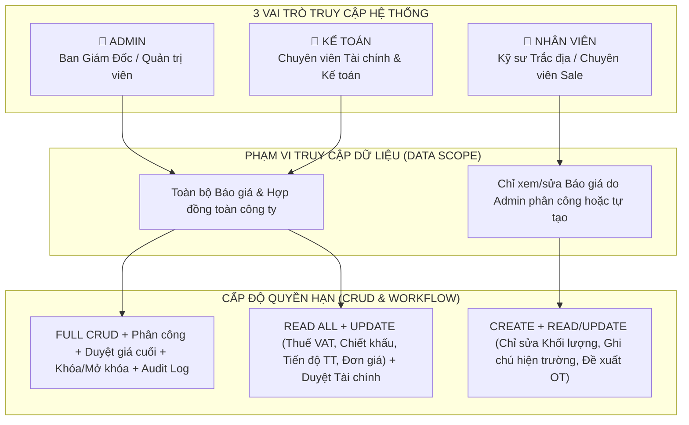
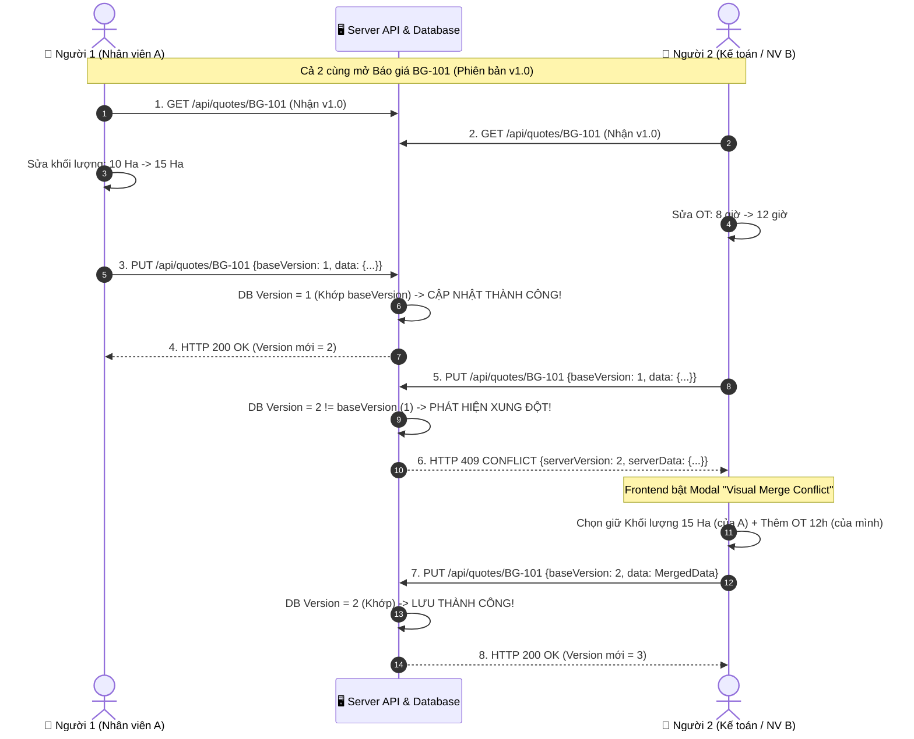

# ĐẶC TẢ PHÂN QUYỀN 3 ROLES & GIẢI PHÁP XỬ LÝ CHỈNH SỬA ĐỒNG THỜI (CONCURRENCY CONTROL)
## HỆ THỐNG BÁO GIÁ TRẮC ĐỊA & HỢP ĐỒNG PHÚC GIA

---

## MỤC LỤC
1. [Tổng Quan 3 Vai Trò Hệ Thống (Roles Overview)](#1-tổng-quan-3-vai-trò-hệ-thống-roles-overview)
2. [Sơ Đồ Phân Quyền Chức Năng (RBAC Architecture)](#2-sơ-đồ-phân-quyền-chức-năng-rbac-architecture)
3. [Ma Trận Phân Quyền CRUD Chi Tiết](#3-ma-trận-phân-quyền-crud-chi-tiết)
4. [Bài Toán & Giải Pháp Xử Lý Chỉnh Sửa Đồng Thời (Concurrency Conflict)](#4-bài-toán--giải-pháp-xử-lý-chỉnh-sửa-đồng-thời-concurrency-conflict)
   - [Bản chất vấn đề (The Lost Update Problem)](#41-bản-chất-vấn-đề-the-lost-update-problem)
   - [Kiến trúc 3 Tầng Bảo Vệ](#42-kiến-trúc-3-tầng-bảo-vệ)
   - [Sơ đồ Luồng Xử lý Xung đột (Sequence Diagram)](#43-sơ-đồ-luồng-xử-lý-xung-đột-sequence-diagram)
   - [Đặc tả Kỹ thuật Backend & Cơ sở dữ liệu (TypeScript Code mẫu)](#44-đặc-tả-kỹ-thuật-backend--cơ-sở-dữ-liệu-typescript-code-mẫu)
   - [Thiết kế Giao diện Giải quyết Xung đột Trực quan (Visual Conflict Resolver)](#45-thiết-kế-giao-diện-giải-quyết-xung-đột-trực-quan-visual-conflict-resolver)
5. [Quy Chuẩn Kiểm Thử & Nghiệm Thu Concurrency](#5-quy-chuẩn-kiểm-thử--nghiệm-thu-concurrency)

---

## 1. TỔNG QUAN 3 VAI TRÒ HỆ THỐNG (ROLES OVERVIEW)

Hệ thống Báo giá Phúc Gia phân định rõ 3 nhóm người dùng nghiệp vụ:

```
┌──────────────────────────┬──────────────────────────┬──────────────────────────┐
│ 👑 ADMIN (GIÁM ĐỐC/QUẢN LÝ)│ 💼 KẾ TOÁN (TÀI CHÍNH/THUẾ)│ 👷 NHÂN VIÊN (KỸ THUẬT/SALE)│
├──────────────────────────┼──────────────────────────┼──────────────────────────┤
│ - Toàn quyền cấu hình    │ - Quản lý tài chính, thuế│ - Bóc tách khối lượng đo │
│ - Phân công người xử lý  │ - Kiểm soát chiết khấu   │ - Nhập giờ OT, phụ cấp   │
│ - Duyệt giá & Hợp đồng   │ - Duyệt điều khoản TT    │ - Lập dự thảo bản nháp   │
│ - Mở khóa / Khôi phục DB │ - Xuất hóa đơn / Báo cáo │ - Chỉ xem file được giao │
└──────────────────────────┴──────────────────────────┴──────────────────────────┘
```

---

## 2. SƠ ĐỒ PHÂN QUYỀN CHỨC NĂNG (RBAC ARCHITECTURE)



---

## 3. MA TRẬN PHÂN QUYỀN CRUD CHI TIẾT

| Chức năng / Hành vi nghiệp vụ | 👑 Admin | 💼 Kế toán | 👷 Nhân viên | Quy chuẩn Kiểm soát & Phòng chống Rủi ro |
| :--- | :---: | :---: | :---: | :--- |
| **Tạo mới báo giá (Create)** |  (Toàn quyền) |  (Tạo dự toán tài chính) |  (Tạo dự thảo kỹ thuật) | Nhân viên tạo mới mặc định ở trạng thái `Bản nháp (Draft)`. |
| **Xem danh sách báo giá (Read)** |  (Toàn bộ công ty) |  (Toàn bộ công ty) |  **(Chỉ file được giao/tự tạo)** | **Chống IDOR/BOLA**: Nhân viên không thể xem file của người khác. |
| **Sửa Khối lượng & Tên công việc đo đạc** |  | ❌ (Chỉ xem) |  (Chỉ khi file đang mở) | Kế toán không được tự ý can thiệp khối lượng kỹ thuật hiện trường. |
| **Sửa Đơn giá gốc & Áp mức Chiết khấu** |  (Mọi mức) |  (Trong định mức $\le 10\%$) | ❌ (Chỉ áp giá định mức) | Ngăn ngừa việc nhân viên tự ý giảm giá làm âm biên lợi nhuận. |
| **Sửa Thuế suất VAT (8% / 10%) & Tạm ứng** |  |  (Chuyên trách) | ❌ (Mặc định theo hệ thống) | Kế toán đảm bảo tính pháp lý về hóa đơn tài chính. |
| **Đề xuất / Nhập giờ làm thêm OT (505k/h)** |  | ❌ (Chỉ kiểm tra tổng tiền) |  (Nhập số giờ thực tế) | Cảnh báo tự động nếu OT vượt quá 40 giờ/tháng. |
| **Phân công người phụ trách (Assign)** |  | ❌ | ❌ | Chỉ Admin có quyền chỉ định 1 hoặc nhiều người cùng xử lý. |
| **Phê duyệt Báo giá (Approval)** |  (Duyệt phát hành) |  (Duyệt tài chính) | ❌ | Phải qua bước duyệt của Kế toán & Admin trước khi gửi khách. |
| **Xóa Báo giá (Delete)** |  (Xóa vĩnh viễn/Thùng rác) | ❌ (Chỉ Lưu trữ - Archive) |  (Chỉ xóa bản nháp của mình) | Tránh nguy cơ mất dữ liệu lịch sử kế toán. |
| **Xuất Excel A4 & Word Hợp đồng** |  (Bản chính thức) |  (Bản chính thức) |  (Kèm Watermark "DỰ THẢO") | Tránh việc gửi báo giá chưa duyệt cho khách hàng. |

---

## 4. BÀI TOÁN & GIẢI PHÁP XỬ LÝ CHỈNH SỬA ĐỒNG THỜI (CONCURRENCY CONFLICT)

### 4.1. Bản chất vấn đề (The Lost Update Problem)
Khi Admin phân công 1 báo giá cho **2 người** (Ví dụ: *Nhân viên A phụ trách bóc khối lượng* và *Nhân viên B hoặc Kế toán phụ trách chi phí phụ cấp/thuế*):
- Cả 2 cùng mở file lúc 14:00 (lúc này file là Version 1).
- Lúc 14:05: Người A sửa xong khối lượng và bấm **Lưu** $\rightarrow$ Server ghi nhận dữ liệu của A thành Version 2.
- Lúc 14:06: Người B sửa xong thuế và bấm **Lưu** (trên nền file Version 1 cũ) $\rightarrow$ **Nếu không có kiểm soát, dữ liệu của B sẽ ghi đè và làm mất sạch toàn bộ khối lượng mà A vừa nhập!**

---

### 4.2. Kiến trúc 3 Tầng Bảo Vệ (Three-tier Concurrency Defense)

```
┌─────────────────────────────────────────────────────────────────────────────┐
│ TẦNG 1: FIELD-LEVEL RBAC SCOPE (Phân tách vùng sửa theo thẩm quyền)         │
│ - Nhân viên chỉ sửa được cột Khối lượng/Hạng mục (Cột Đơn giá/Thuế bị khóa) │
│ - Kế toán chỉ sửa được cột Đơn giá/Thuế/Chiết khấu (Cột Khối lượng chỉ đọc) │
├─────────────────────────────────────────────────────────────────────────────┤
│ TẦNG 2: OPTIMISTIC CONCURRENCY CONTROL (Kiểm soát phiên bản qua ETag/Version)│
│ - Mỗi lần Lưu, Client gửi kèm version hiện tại.                            │
│ - Server từ chối ghi đè nếu DB đã có version mới hơn (Trả về 409 Conflict). │
├─────────────────────────────────────────────────────────────────────────────┤
│ TẦNG 3: VISUAL CONFLICT RESOLVER (Giao diện Hợp nhất & So sánh trực quan)  │
│ - Không làm mất dữ liệu người đến sau.                                     │
│ - Bật bảng so sánh 3 cột: Dữ liệu Server vs Dữ liệu Bạn vừa sửa vs Kết quả.│
└─────────────────────────────────────────────────────────────────────────────┘
```

---

### 4.3. Sơ đồ Luồng Xử lý Xung đột (Sequence Diagram)



---

### 4.4. Đặc tả Kỹ thuật Backend & Cơ sở dữ liệu (TypeScript Code mẫu)

#### Schema Database:
```sql
CREATE TABLE quotes (
    id TEXT PRIMARY KEY,
    quote_code TEXT NOT NULL UNIQUE,
    data JSON NOT NULL,
    version INTEGER NOT NULL DEFAULT 1,
    status TEXT NOT NULL DEFAULT 'nhap',
    created_by TEXT NOT NULL,
    assigned_to JSON NOT NULL, -- Mảng chứa danh sách UserIDs được phân công
    last_updated_by TEXT NOT NULL,
    updated_at DATETIME NOT NULL DEFAULT CURRENT_TIMESTAMP
);
```

#### Logic Middleware & Controller Backend:
```typescript
import { Request, Response } from 'express';
import { db } from '../db';

interface UpdateQuoteRequest {
  quoteId: string;
  baseVersion: number; // Version lúc client mở file
  data: any;
  userId: string;
  userName: string;
}

export async function updateQuoteWithOCC(req: Request, res: Response) {
  const { quoteId, baseVersion, data, userId, userName }: UpdateQuoteRequest = req.body;

  // 1. Lấy dữ liệu hiện tại từ Database
  const quote = db.prepare('SELECT * FROM quotes WHERE id = ?').get(quoteId);
  if (!quote) {
    return res.status(404).json({ error: 'Báo giá không tồn tại.' });
  }

  // 2. KIỂM TRA PHÂN QUYỀN XỬ LÝ (Chống IDOR)
  const assignedUsers: string[] = JSON.parse(quote.assigned_to || '[]');
  const isSuperAdmin = req.user.role === 'admin';
  if (!isSuperAdmin && !assignedUsers.includes(userId) && quote.created_by !== userId) {
    return res.status(403).json({ error: 'Bạn không có quyền chỉnh sửa báo giá này.' });
  }

  // 3. KIỂM TRA XUNG ĐỘT PHIÊN BẢN (OCC CHECK)
  if (quote.version !== baseVersion) {
    return res.status(409).json({
      error: 'CONCURRENCY_CONFLICT',
      message: `Báo giá đã được cập nhật bởi ${quote.last_updated_by} vào lúc ${quote.updated_at}.`,
      currentVersion: quote.version,
      serverData: JSON.parse(quote.data), // Dữ liệu mới nhất trên Server
      clientData: data                    // Dữ liệu người dùng đang muốn gửi lên
    });
  }

  // 4. CẬP NHẬT AN TOÀN & TĂNG VERSION (Atomic Update)
  const newVersion = quote.version + 1;
  const updateStmt = db.prepare(`
    UPDATE quotes 
    SET data = ?, version = ?, last_updated_by = ?, updated_at = CURRENT_TIMESTAMP
    WHERE id = ? AND version = ?
  `);

  const result = updateStmt.run(JSON.stringify(data), newVersion, userName, quoteId, baseVersion);

  if (result.changes === 0) {
    // Trường hợp hiếm gặp: Race condition đúng miligiây
    return res.status(409).json({ error: 'CONCURRENCY_CONFLICT', message: 'Dữ liệu vừa thay đổi, vui lòng thử lại.' });
  }

  // 5. Ghi nhật ký Audit Log
  db.prepare(`
    INSERT INTO audit_logs (id, quote_id, user_id, action, version, timestamp)
    VALUES (?, ?, ?, 'UPDATE_QUOTE', ?, CURRENT_TIMESTAMP)
  `).run(crypto.randomUUID(), quoteId, userId, newVersion);

  return res.status(200).json({ success: true, version: newVersion, message: 'Lưu báo giá thành công!' });
}
```

---

### 4.5. Thiết kế Giao diện Giải quyết Xung đột Trực quan (Visual Conflict Resolver)

Khi gặp lỗi `409 CONFLICT`, Frontend kích hoạt giao diện Hợp nhất trực quan:

```
┌─────────────────────────────────────────────────────────────────────────────┐
│ ⚠️ PHÁT HIỆN THAY ĐỔI ĐỒNG THỜI TRÊN BÁO GIÁ BG-2026-01                    │
│ "Nhân viên Nguyễn Văn A vừa lưu phiên bản v2.0 cách đây 1 phút"             │
├──────────────────────────┬──────────────────────────┬───────────────────────┤
│ DỮ LIỆU MỚI TRÊN SERVER  │ DỮ LIỆU BẠN VỪA SỬA      │ KẾT QUẢ HỢP NHẤT      │
│ (Do Nguyễn Văn A lưu)    │ (Chưa lưu được)          │ (Sẽ lưu thành v3.0)   │
├──────────────────────────┼──────────────────────────┼───────────────────────┤
│ 🔹 Hạng mục 1: 15 Ha     │ 🔸 Hạng mục 1: 10 Ha     │ [☑ Giữ 15 Ha của A]   │
│ 🔹 Giờ OT: 8 giờ         │ 🔸 Giờ OT: 12 giờ        │ [☑ Giữ 12h của bạn]   │
│ 🔹 Thuế VAT: 8%          │ 🔸 Thuế VAT: 8%          │ 8% (Không thay đổi)   │
├──────────────────────────┴──────────────────────────┴───────────────────────┤
│ [🔄 Hủy sửa & Tải lại từ Server]            [💾 Xác nhận Gộp & Lưu Bản v3.0]│
└─────────────────────────────────────────────────────────────────────────────┘
```

---

## 5. QUY CHUẨN KIỂM THỬ & NGHIỆM THU CONCURRENCY

| Kịch bản kiểm thử | Hành động kiểm thử | Kết quả kỳ vọng (DoD) |
| :--- | :--- | :--- |
| **Test 1: Phân quyền IDOR** | Nhân viên A mở URL báo giá của Nhân viên B (không được assign). | Trả về `403 Forbidden`, không lộ dữ liệu. |
| **Test 2: Phân tách quyền ô** | Nhân viên A cố gắng gửi request sửa trường `vatRate = 0%`. | Server từ chối, chỉ Kế toán/Admin mới sửa được VAT. |
| **Test 3: Xung đột đồng thời** | Mở 2 tab trình duyệt cùng 1 báo giá v1, tab 1 lưu trước $\rightarrow$ tab 2 lưu sau. | Tab 2 nhận mã lỗi `409 Conflict`, hiện bảng so sánh Diff. |
| **Test 4: Merge an toàn** | Tab 2 chọn merge dữ liệu và xác nhận lưu. | File được lưu thành v3 thành công, không mất số liệu của tab 1. |
| **Test 5: Audit Trail** | Kiểm tra bảng `audit_logs`. | Thấy rõ 2 bản ghi sửa đổi: Bản 1 do User A lúc 14:05, Bản 2 do User B lúc 14:07. |
